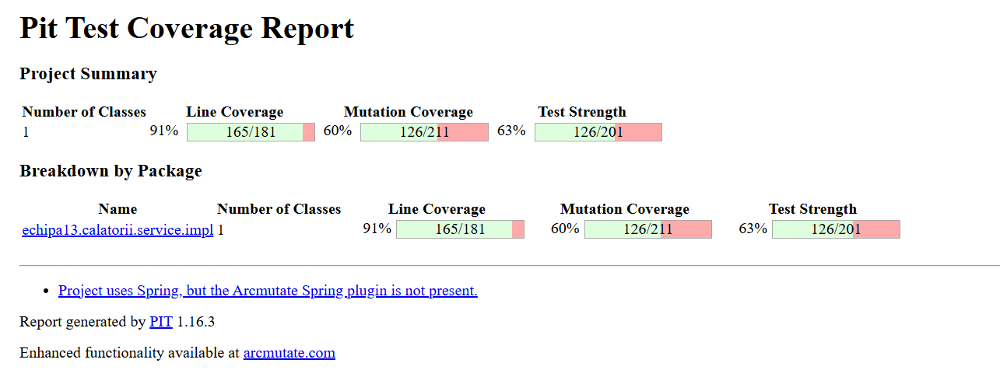

# Proiect TSS - Testarea Sistemelor Software
##  Tema 3 - Testare Unitara in Java

## Componența echipei

| Nume | Rol |
|------|-----|
| Gheorghe Denisa | Membru |
| Iftime Raluca | Membru |
| Lupeș Ioan-Marian | Membru |


## Cuprins

1. [Descriere proiect](#descriere-proiect)
2. [Configurare software](#configurare-software)
3. [Structura proiectului](#structura-proiectului)
4. [Clasa testată](#clasa-testată)
5. [Strategii de testare aplicate](#strategii-de-testare-aplicate)
6. [Rezultate JaCoCo](#rezultate-jacoco)
7. [Rezultate PITest](#rezultate-pitest)
8. [Suita AI - comparație](#suita-ai--comparație)
9. [Cum rulezi proiectul](#cum-rulezi-proiectul)
10. [Referințe](#referințe)

## Descriere proiect

Proiectul implementează o aplicație web de gestiune a călătoriilor, dezvoltată în Spring Boot. Modulul ales pentru testare este `WalletServiceImpl`, un serviciu care se ocupă de bugetul fiecărei călătorii. Funcționalitățile lui acoperă:

- crearea și gestionarea unui portofel asociat unui itinerariu;
- setarea și actualizarea bugetului total (RON sau EUR);
- adăugarea și ștergerea tranzacțiilor (cheltuieli pe categorii);
- calculul unui sumar KPI: buget total, cheltuit, rămas, procent utilizat, status;
- generarea de insights pe categorii de cheltuieli și zile active;
- recomandări de buget pe baza unui burn-rate, a unei alocări zilnice (allowance/zi) și a unui forecast de depășire.

Am ales acest modul pentru că are logică suficientă cât să merite testată, fără să fie nici un simplu CRUD, nici prea împletit cu Spring Security.

## Configurare software

| Tool | Versiune |
|------|----------|
| Java | OpenJDK 24 |
| Spring Boot | 3.3.4 |
| Maven | 3.8+ |
| JUnit | 5.10.3 |
| Mockito | 5.11.0 |
| JaCoCo | 0.8.11 |
| PITest | 1.16.3 |
| IntelliJ IDEA | 2024.3.5 |

Sistemul de operare folosit a fost Windows 11 (PowerShell pentru rularea comenzilor Maven). Nu a fost necesară o mașină virtuală.

## Structura proiectului

```
src/
├── main/java/echipa13/calatorii/
│   ├── service/impl/
│   │   └── WalletServiceImpl.java         <- clasa testată
│   ├── models/
│   │   ├── Trip.java
│   │   ├── TripWallet.java
│   │   ├── WalletTransaction.java
│   │   ├── WalletCategory.java
│   │   └── UserEntity.java
│   ├── repository/
│   │   ├── TripRepository.java
│   │   ├── TripWalletRepository.java
│   │   ├── UserRepository.java
│   │   └── WalletTransactionRepository.java
│   └── Dto/
│       ├── WalletSummary.java
│       ├── WalletInsights.java
│       └── WalletCategoryTotal.java
│
└── test/java/echipa13/calatorii/service/impl/
    ├── WalletServiceImplEquivalenceTest.java    <- Equivalence Partitioning
    ├── WalletServiceImplBoundaryTest.java       <- Boundary Value Analysis
    ├── WalletServiceImplStatementTest.java      <- Statement Coverage
    ├── WalletServiceImplDecisionTest.java       <- Decision Coverage
    ├── WalletServiceImplConditionTest.java      <- Condition Coverage
    ├── WalletServiceImplCircuitsTest.java       <- Basis Path / Circuits
    ├── WalletServiceImplMutationTest.java       <- Mutation Testing
    ├── WalletServiceImplMathTest.java           <- teste pentru mutanți Math
    └── WalletServiceImplAITest.java             <- suita generată de AI

docs/
├── ai-report.md                                <- raport comparativ AI
└── screenshots/
    ├── jacoco-report.png
    ├── pitest-report.png
    ├── ai-prompt.png
    └── ai-build-failed.png
```

## Clasa testată

`WalletServiceImpl` reprezintă clasa testată.

În ordinea priorității, metodele acoperite sunt:

| Metodă | Complexitate | Strategii aplicate |
|--------|-------------|-------------------|
| `computeSummaryOwnedByUser` | ridicată | EP, BVA, Decision, Condition, Circuits, Mutation |
| `addExpenseOwnedByUser` | ridicată | EP, BVA, Statement |
| `updateBudgetOwnedByUser` | medie | BVA |
| `computeInsightsOwnedByUser` | medie | Statement |
| `getOrCreateWalletOwnedByUser` | scăzută | Statement, Mutation |

Motivele alegerii:

- conține logică matematică reală cu `BigDecimal` și rounding `HALF_UP`, deci se pretează bine la mutanți matematici;
- are peste 15 ramuri `if/else`, bun pentru branch coverage;
- are o stare clară definită de un enum: `OK / ATENTIE / DEPASIT / NESETAT`, ceea ce face teste deterministe;

## Strategii de testare aplicate

### 1. Partiționare în clase de echivalență — `WalletServiceImplEquivalenceTest`

Am împărțit inputurile în clase unde comportamentul serviciului este același pentru orice valoare din clasă. În felul acesta, alegem un singur reprezentant pe clasă, în loc să testăm cazuri redundante.

**Clase de echivalență pentru `computeSummaryOwnedByUser`:**

| Clasă | Condiție | Status așteptat |
|-------|----------|-----------------|
| CE1 | budget = null | NESETAT |
| CE2 | budget = 0 | NESETAT |
| CE3 | 0% <= cheltuit < 75% | OK |
| CE4 | 75% <= cheltuit < 100% | ATENTIE |
| CE5 | cheltuit >= 100% | DEPASIT |
| CE6 | totalSpent = null la nivel DB | OK (tratat ca zero) |

**Clase pentru `addExpenseOwnedByUser`:**

| Clasă | Condiție | Comportament |
|-------|----------|-------------|
| CE7 | amount <= 0 | IllegalArgumentException |
| CE8 | amount > 0 | salvat corect |
| CE9 | title blank | IllegalArgumentException |
| CE10 | title non-blank | salvat corect |
| CE11 | dayIndex <= 0 | IllegalArgumentException |
| CE12 | dayIndex >= 1 | salvat corect |

### 2. Analiza valorilor de frontieră — `WalletServiceImplBoundaryTest`

Aici nu mai luăm orice valoare din clasă, ci exact valoarea de pe muchie și vecinii ei. Bug-urile clasice apar fix la `<` vs `<=`.

**Frontiere pentru procentul din buget:**

```
0%----74%  |  75%----99%  |  100%+
   OK      |   ATENTIE    |  DEPASIT
           ↑              ↑
        testăm         testăm
        74 și 75       99 și 100
```

| Valoare testată | Procent | Status așteptat | De ce |
|-----------------|---------|-----------------|-------|
| 74 RON / 100 RON | 74% | OK | ultimul OK |
| 75 RON / 100 RON | 75% | ATENTIE | exact pe prag |
| 99 RON / 100 RON | 99% | ATENTIE | ultimul ATENTIE |
| 100 RON / 100 RON | 100% | DEPASIT | exact pe prag |

**Frontiere pentru `addExpenseOwnedByUser`:**

| Parametru | Valoare | Valid/Invalid | Justificare |
|-----------|---------|---------------|-------------|
| amount | 0 | invalid | exact pe `<= 0` |
| amount | 0.01 | valid | primul valid |
| amount | -10 | invalid | sub frontieră |
| title | "" | invalid | string gol |
| title | "a" | valid | cel mai scurt valid |
| dayIndex | 0 | invalid | exact pe `<= 0` |
| dayIndex | 1 | valid | primul valid |
| dayIndex | 999 | valid | valoare mare, încă acceptată |

### 3. Acoperire la nivel de instrucțiune — `WalletServiceImplStatementTest`

Fiecare linie de cod să fie executată cel puțin o dată.

**Rezultate JaCoCo, Statement Coverage:** 91% (818 din 893 instrucțiuni).

Liniile rămase neacoperite sunt în metodele cu cod defensiv din interior:

- `computeSmartBudgetAdviceOwnedByUser` — 96%
- `computeInsightsOwnedByUser` — 55% (aici sunt cele mai multe ramuri „defensive”)
- `findUserByUsernameOrEmail` — 82%

### 4. Acoperire la nivel de decizie — `WalletServiceImplDecisionTest`

Fiecare instrucțiune `if` trebuie evaluată și pe `true`, și pe `false`. Practic, fiecare ramură principală a deciziei trebuie atinsă.

**Rezultate JaCoCo, Branch Coverage:** 80% (121 din 150 ramuri).

Decizii acoperite complet (100%):

- `addExpenseOwnedByUser`
- `computeSummaryOwnedByUser`
- `updateBudgetOwnedByUser`
- `deleteTransactionOwnedByUser`

Decizii doar parțial acoperite:

- `buildRecommendation` — 76%
- `computeSmartBudgetAdviceOwnedByUser` — 75%
- `computeInsightsOwnedByUser` — 50%

### 5. Acoperire la nivel de condiție — `WalletServiceImplConditionTest`

Pentru orice condiție compusă, fiecare operand din ea trebuie evaluat și pe `true`, și pe `false`. Asta merge un nivel mai adânc decât Decision.

Exemplu - condiția compusă din `computeSummaryOwnedByUser`:

```java
if (budget == null || budget.compareTo(BigDecimal.ZERO) <= 0)
```

| Test | budget | Rezultat condiție | Status |
|------|--------|-------------------|--------|
| budget null | null | true (primul termen) | NESETAT |
| budget zero | 0 | true (al doilea termen) | NESETAT |
| budget valid | 200 | false (ambii termeni) | continuă calculul |

În felul acesta nu doar că am acoperit ramura totală, dar fiecare sub-condiție individual e evaluată pe ambele valori (TRUE și FALSE).

### 6. Circuite independente — `WalletServiceImplCircuitsTest`

Complexitatea McCabe se calculează ca:

```
V(G) = numărul de decizii + 1
```

Pentru `computeSummaryOwnedByUser`:

```
V(G) = 4 decizii + 1 = 5 circuite minime
```

Am identificat 7 circuite independente:

| Circuit | Descriere | Test |
|---------|-----------|------|
| C1 | User negăsit -> excepție | `circuit_user_not_found` |
| C2 | Wallet negăsit -> excepție | `circuit_wallet_not_found` |
| C3 | 0-74% -> OK | `circuit_OK_state` |
| C4 | 75-99% -> ATENTIE | `circuit_WARNING_state` |
| C5 | >=100% -> DEPASIT | `circuit_OVER_state` |
| C6 | Exact 75% -> ATENTIE | `circuit_boundary_75` |
| C7 | null din DB -> 0% -> OK | `circuit_null_sum_should_be_zero` |

### 7. Analiză raport mutanți + teste suplimentare — `WalletServiceImplMathTest` + `WalletServiceImplMutationTest`

Mutation Score final: **60%** (125 din 211 mutanți omorâți).

Raport pe tipuri de mutatori:

| Mutator | Generați | Omorâți | Supraviețuiți | Kill Rate |
|---------|---------|--------|--------------|-----------|
| NullReturnValsMutator | 18 | 17 | 1 | 94% |
| VoidMethodCallMutator | 11 | 11 | 0 | 100% |
| RemoveConditionalMutator_EQUAL | 53 | 30 | 22 | 57% |
| RemoveConditionalMutator_ORDER | 21 | 12 | 8 | 57% |
| ConditionalsBoundaryMutator | 21 | 7 | 13 | 33% |
| EmptyObjectReturnValsMutator | 9 | 4 | 2 | 44% |
| MathMutator | 4 | 0 | 2 | 0% |
| **TOTAL** | **211** | **125** | ~76 | **60%** |

Cei doi mutanți neechivalenți pe care i-am țintit explicit sunt:

**Mutantul 1 — MathMutator** (`*` schimbat cu `/`):

PITest a alterat calculul procentului din:

```java
totalSpent.multiply(BigDecimal.valueOf(100)).divide(budget, 0, RoundingMode.HALF_UP)
```

cu o variantă în care operatorii sunt inversați. Testul `should_kill_percent_math_mutations` îl omoară: pentru 50/200 cu *100 ne dă exact 25%, iar dacă operatorii ar fi schimbați, valoarea n-ar mai fi 25.

**Mutantul 2 — ConditionalsBoundaryMutator** (`>=` schimbat cu `>`):

Mutația schimbă `if (percent >= 75)` în `if (percent > 75)`. Diferența e pe valoarea exactă 75: cu `>=` intră în ATENTIE, cu `>` rămâne în OK. Testul `testSumar_ExactPragAtentie_75LaSuta` distinge clar cele două cazuri.

## Rezultate JaCoCo


- **Statement Coverage: 91%** (818/893 instrucțiuni)
- **Branch Coverage: 80%** (121/150 ramuri)

| Metodă | Statement | Branch |
|--------|-----------|--------|
| `addExpenseOwnedByUser` | 100% | 100% |
| `computeSummaryOwnedByUser` | 100% | 100% |
| `updateBudgetOwnedByUser` | 100% | 100% |
| `deleteTransactionOwnedByUser` | 100% | 100% |
| `buildRiskUi` | 100% | 91% |
| `buildRecommendation` | 100% | 76% |
| `computeSmartBudgetAdviceOwnedByUser` | 96% | 75% |
| `findUserByUsernameOrEmail` | 82% | 62% |
| `computeInsightsOwnedByUser` | 55% | 50% |

Procentele care lipsesc până la 100% sunt în mare parte ramuri „defensive”: verificări `null` pe valori care, în runtime real, nu pot fi null pentru că JPA și `@PrePersist` le inițializează automat. Pentru a le forța am avea nevoie de `@Spy` peste metoda testată, ceea ce ar însemna să mock-ui exact lucrul pe care vrem să-l testăm. 

## Rezultate PITest



Mutation Score: **60%** (125 din 211 mutanți omorâți).

**Puncte forte:**

- `VoidMethodCallMutator` — 100%: toate apelurile la repository sunt verificate cu `verify()`.
- `NullReturnValsMutator` — 94%: aproape toate obiectele returnate sunt verificate cu `assertNotNull`.

**Puncte slabe:**

- `MathMutator` — 0%: liniile cu calcule matematice din metodele complexe nu sunt acoperite suficient pentru a distinge mutanții (operatori inversați).
- `ConditionalsBoundaryMutator` — 33%: lipsesc testele care să atingă fix valorile exacte de pe granițe în toate metodele.

Acestea sunt piste clare de îmbunătățire dacă vrem să urcăm scorul peste 75%.

## Suita AI - comparație

Raportul complet și capturile de ecran sunt în [docs/ai-report.md](docs/ai-report.md). 

| Criteriu | Suita proprie | Suita AI |
|----------|---------------|----------|
| Nr. teste | ~40 | ~10 |
| Compilează | Da | Nu (peste 40 de erori) |
| Rulează | Da | Nu compilează |
| Statement coverage | 91% | 0% |
| Branch coverage | 80% | 0% |
| Mutation score | 60% | 0% |

Pe scurt, AI-ul a dat un schelet plauzibil, dar a inventat clase și metode care nu există în proiect. Detalii și analiză în raport.

## Cum rulezi proiectul

### Cerințe

- Java 17 sau mai nou
- Maven 3.8+

### Rulare teste unitare

```bash
mvn test
```

### Generare raport JaCoCo

```bash
mvn test
# după aceea deschizi target/site/jacoco/index.html în browser
```

### Rulare PITest

```bash
mvn test-compile org.pitest:pitest-maven:mutationCoverage
# după aceea deschizi target/pit-reports/index.html
```

Atenție: PITest durează între 5 și 15 minute pentru toți mutanții, deci nu te speria dacă aparent „nu se mai termină” - rulează în continuare.

### Rulare doar pe suita proprie (fără AI)

```bash
mvn test -Dtest="WalletServiceImplEquivalenceTest,WalletServiceImplBoundaryTest,WalletServiceImplStatementTest,WalletServiceImplDecisionTest,WalletServiceImplConditionTest,WalletServiceImplCircuitsTest,WalletServiceImplMutationTest,WalletServiceImplMathTest"
```

## Referințe

[1] Myers, G. J., Sandler, C., Badgett, T., *The Art of Software Testing*, ediția a 3-a, Wiley, 2011.

[2] Martin, R. C., *Clean Code: A Handbook of Agile Software Craftsmanship*, Prentice Hall, 2008.

[3] PITest Documentation, https://pitest.org/quickstart/maven/, accesat în aprilie 2026.

[4] JaCoCo Documentation, https://www.jacoco.org/jacoco/trunk/doc/, accesat în aprilie 2026.

[5] Mockito Documentation, https://javadoc.io/doc/org.mockito/mockito-core/latest/, accesat în aprilie 2026.

[6] JUnit 5 User Guide, https://junit.org/junit5/docs/current/user-guide/, accesat în aprilie 2026.

[7] OpenAI, ChatGPT, https://chat.openai.com, generare aprilie 2026. Folosit pentru generarea suitei AI (`WalletServiceImplAITest.java`).

[8] Anthropic, Claude, https://claude.ai, aprilie 2026. Folosit ca asistent pentru debug Mockito, explicații pe mutanți PITest și pentru structurarea strategiei de testare a suitei proprii.
