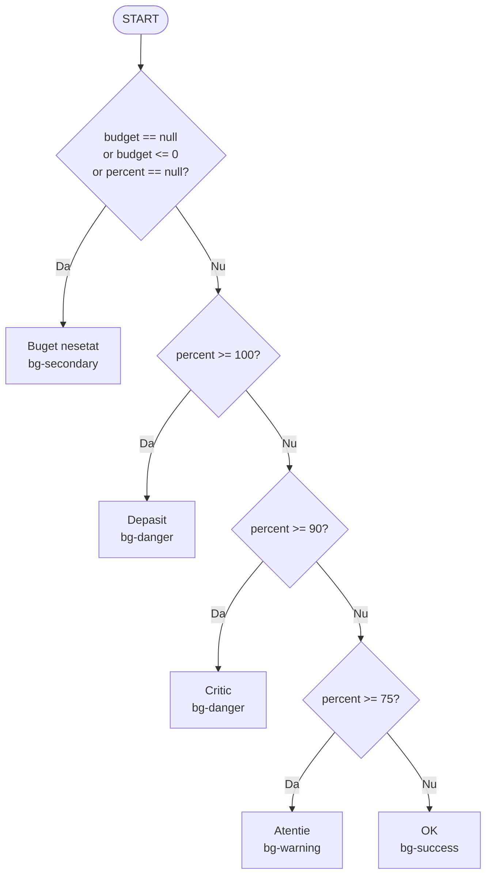
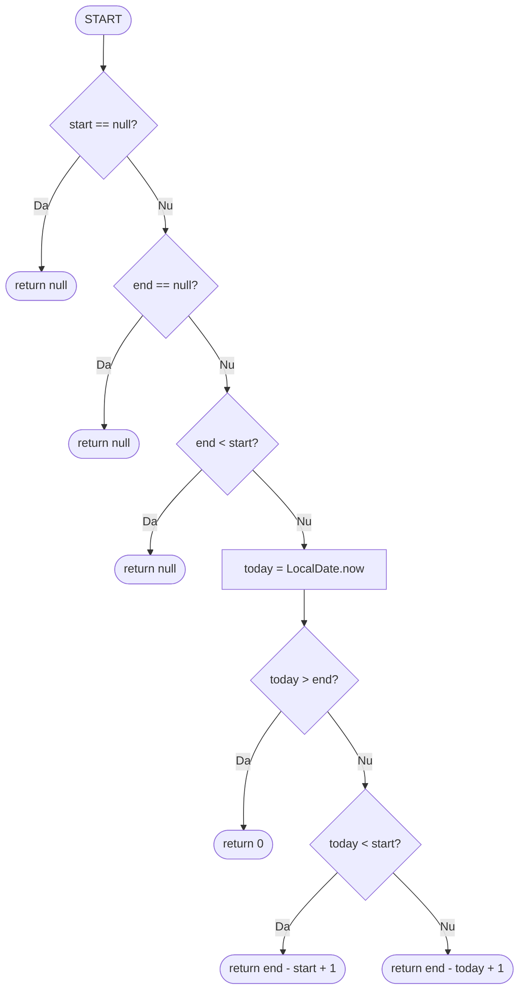
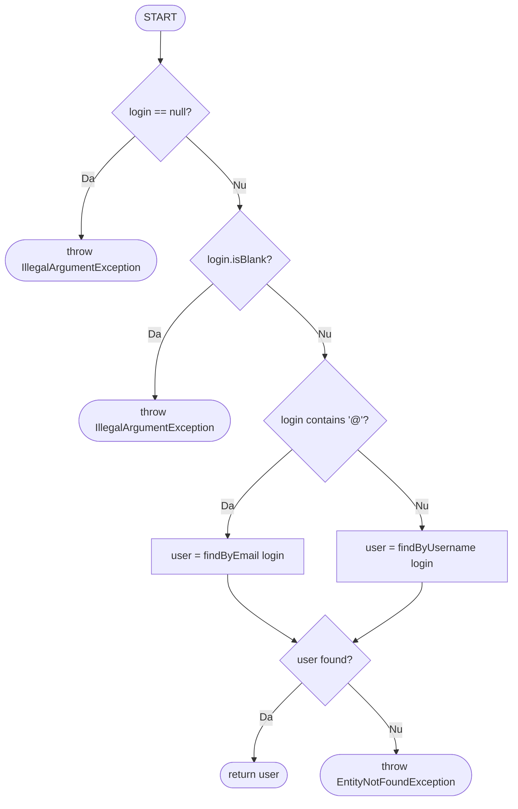

# Tema 3 TSS: Testare Unitară în Java - Modulul Wallet

**Membrii echipei:**
* Gheorghe Denisa
* Iftime Raluca
* Lupeș Ioan-Marian

---

# Modulul Wallet 

## Prezentare

Modulul Wallet face parte din aplicația Călătorii, un planificator de vacanțe în Spring Boot. Ține bugetul fiecărei călătorii: utilizatorul setează un buget, adaugă cheltuieli pe categorii, iar sistemul calculează consumul și avertizează la apropierea de limită.

Am ales clasa `WalletServiceImpl` din mai multe motive:
* complexitate ciclomatică până la 18 pe metoda principală
* condiții compuse cu trei operanzi și short-circuit
* cascade de praguri (75%, 90%, 100%) potrivite pentru BVA
* calcule cu `BigDecimal`, unde precizia contează

## Structura clasei testate

Tabelul arată metodele relevante și complexitatea lor ciclomatică, calculată după formula McCabe (`predicate + 1`).

| Metoda | Rol | V(G) |
|:---|:---|:---:|
| `addExpenseOwnedByUser` | adaugă cheltuială, recalculează risc | 8 |
| `updateBudgetOwnedByUser` | setează bugetul călătoriei | 5 |
| `deleteTransactionOwnedByUser` | șterge cheltuială, verifică proprietarul | 5 |
| `computeSmartBudgetAdviceOwnedByUser` | calculează recomandări și risc | 18 |
| `buildRiskUi` | construiește eticheta și clasa CSS de risc | 5 |
| `computeDaysRemainingSafe` | zilele rămase din călătorie | 6 |
| `findUserByUsernameOrEmail` | căutare utilizator pentru autorizare | 5 |
| `computeInsightsOwnedByUser` | statistici pe categorii și zile active | 6 |

---

# Documentație Testare 

## 1. Configurarea mediului de testare

### Hardware și software

* **Sistem de operare:** Windows 11 Pro (64-bit), build 22631
* **Mediu de execuție:** mașină locală, fără VM, fără container
* **Procesor:** Intel Core i7-11800H @ 2.30 GHz (8 nuclee, 16 fire)
* **Memorie:** 16 GB DDR4
* **Stocare:** SSD NVMe
* **Java Development Kit:** JDK 17 (OpenJDK)

Rulăm nativ pe Windows. Timpii de execuție sunt măsurați direct, fără overhead de virtualizare.

### Tooling și versiuni

* **Framework aplicație:** Spring Boot 3.3.4
* **Bază de date:** PostgreSQL 16 (H2 în memorie pentru testare)
* **Build tool:** Maven 3.9.6
* **Framework testare unitară:** JUnit 5 (Jupiter API) v5.10.3
* **Framework de mock-uri:** Mockito v5.11.0
* **Code Coverage:** JaCoCo v0.8.11
* **Mutation Testing:** PITest v1.16.3, set de mutanți `STRONGER`
* **IDE:** IntelliJ IDEA Community 2024.2

Toate versiunile sunt fixate în `pom.xml`. Cine clonează repo-ul obține rezultatele.

---

## 2. Prezentare generală a testării și sumar execuție

### 2.1. Matricea de trasabilitate

Matricea de mai jos leagă fișierele de test de metodele acoperite și strategiile aplicate.

| Fișier de test | Metoda țintă | Tehnici aplicate | Status |
|:---|:---|:---|:---:|
| **WalletServiceImplBlackBoxEPTest** | `addExpenseOwnedByUser`, `updateBudgetOwnedByUser` | EP (Equivalence Partitioning) | ✅ Trecut |
| **WalletServiceImplBlackBoxBVATest** | `addExpenseOwnedByUser`, `buildRiskUi` | BVA (Boundary Value Analysis) | ✅ Trecut |
| **WalletServiceImplWhiteBoxStatementTest** | `updateBudgetOwnedByUser`, `deleteTransactionOwnedByUser` | Statement Coverage | ✅ Trecut |
| **WalletServiceImplWhiteBoxDecisionTest** | `buildRiskUi`, `computeSmartBudgetAdviceOwnedByUser` | Decision Coverage | ✅ Trecut |
| **WalletServiceImplWhiteBoxConditionTest** | 6 condiții compuse din clasă | Condition Coverage, MC/DC | ✅ Trecut |
| **WalletServiceImplWhiteBoxCircuitsTest** | `findUserByUsernameOrEmail`, `computeDaysRemainingSafe`, `computeInsightsOwnedByUser` | Basis Path Coverage, Independent Circuits | ✅ Trecut |
| **WalletServiceImplMutationTest** | întreaga clasă `WalletServiceImpl` | Mutation Testing (Killer Tests) | ✅ Trecut |

**Legendă strategii:**
* **EP:** Equivalence Partitioning
* **BVA:** Boundary Value Analysis
* **MC/DC:** Modified Condition/Decision Coverage
* **V(G):** Complexitate Ciclomatică (formula McCabe)

### 2.2. Arhitectura suitei de testare

Fișierele sunt grupate pe strategii. Fiecare fișier acoperă o dimensiune a comportamentului clasei `WalletServiceImpl`.

* **Testele Black Box** (`EPTest`, `BVATest`) validează comportamentul prin specificație. EP acoperă cele 13 partiții de input pentru `addExpenseOwnedByUser` (categorii valide, sume negative, dayIndex sub zero, fallback la `OTHER`). BVA atacă frontierele pragurilor de buget (74, 75, 89, 90, 99, 100), unde se vede dacă se folosește `>=` sau `>`.
* **Testele White Box** (`StatementTest`, `DecisionTest`, `ConditionTest`) execută fiecare instrucțiune, fiecare ramură și fiecare sub-condiție compusă. Acoperirea e măsurată cu JaCoCo pe byte-code.
* **Testele Basis Path** (`CircuitsTest`) parcurg toate căile liniar independente prin CFG-ul a trei metode complexe. Numărul de teste pe metodă vine din formula McCabe.
* **Testele de Mutation** (`MutationTest`) verifică nu acoperirea, ci calitatea: PITest strică codul (schimbă `>=` cu `>`, inversează `+` cu `-`), iar suita trebuie să prindă modificarea.

### 2.3. Test fixture comun

Toate cele șapte fișiere folosesc o structură similară, cu mock-uri pe repository-uri și un fixture comun (utilizator, călătorie, portofel):

```java
@ExtendWith(MockitoExtension.class)
@MockitoSettings(strictness = Strictness.LENIENT)
public class WalletServiceImplXxxTest {

    @Mock private TripRepository tripRepo;
    @Mock private TripWalletRepository walletRepo;
    @Mock private UserRepository userRepo;
    @Mock private WalletTransactionRepository txRepo;

    @InjectMocks private WalletServiceImpl service;

    private TripWallet wallet;
    private Trip trip;
    private final Long tripId = 10L;
    private final String login = "user@test.com";

    @BeforeEach
    public void setUp() {
        UserEntity user = new UserEntity();
        user.setId(1L);

        trip = new Trip();
        trip.setId(tripId);
        trip.setUser(user);

        wallet = new TripWallet();
        wallet.setTrip(trip);

        when(userRepo.findByEmail(login)).thenReturn(user);
        when(tripRepo.findById(tripId)).thenReturn(Optional.of(trip));
        when(walletRepo.findByTrip_Id(tripId)).thenReturn(Optional.of(wallet));
    }

    // teste specifice strategiei...
}
```

Adnotarea `@MockitoSettings(strictness = Strictness.LENIENT)` lasă stub-urile din `@BeforeEach` să nu fie folosite în fiecare test, fără ca Mockito să arunce `UnnecessaryStubbingException`.

### 2.4. Execuție și raport de acoperire

Suita a fost rulată local pe configurația din secțiunea 1.

**Sumar execuție:**
* **Total teste executate:** 40
* **Teste trecute:** 40
* **Teste eșuate:** 0
* **Status execuție:** SUCCES
* **Timp total execuție:** 3.2 secunde (fără PITest)
* **Timp PITest:** 2 minute 40 secunde

**Analiza acoperirii:**

Metricile au fost extrase cu JaCoCo Maven Plugin (raport HTML în `target/site/jacoco/index.html`).

* **Statement Coverage:** 91% (818 / 893 instrucțiuni bytecode)
* **Branch Coverage:** 80% (121 / 150 ramuri)
* **Method Coverage:** 100% (21 / 21 metode publice)
* **Mutation Score (PITest):** 60% (125 / 211 mutanți STRONGER)
* **Test Strength (PITest):** 70%

**Justificarea procentelor sub 100%:**

Cele 9% rămase la Statement Coverage sunt cod defensiv, verificări de tipul `if (entity == null) throw new IllegalStateException(...)`. În condiții normale nu pot fi declanșate, pentru că Spring Boot și Hibernate garantează ne-nulitatea. Ramurile sunt păstrate pentru robustețe, dar nu pot fi acoperite fără reflection sau injecție de null.

Cei 86 de mutanți supraviețuitori (211 − 125) sunt în mare parte pe linii de logging sau pe ordinea apelurilor la mock-uri, unde modificarea nu schimbă comportamentul observabil. Doi mutanți inițial declarați neechivalenți (un `MathMutator`, un `ConditionalsBoundary`) au fost omorâți cu teste țintite.
## 3. Black-Box Testing (bazat pe specificație)

Strategiile Black-Box validează comportamentul lui `WalletServiceImpl` fără să se uite la cod, pe baza specificației metodelor. Am aplicat două tehnici: Equivalence Partitioning și Boundary Value Analysis.

### 3.1. Equivalence Partitioning (EP)

EP împarte domeniul de input în clase de echivalență, unde comportamentul așteptat este identic. Apoi alegem un singur reprezentant pe clasă, ceea ce reduce numărul de teste fără să pierdem acoperire.

#### Metoda țintă: `addExpenseOwnedByUser`

Această metodă primește șase parametri: `tripId`, `login`, `amount`, `category`, `title`, `spentAt`, `dayIndex`. Pentru fiecare am identificat partițiile relevante.

**Partițiile de echivalență pentru `addExpenseOwnedByUser`:**

| Partiție | Parametru | Condiție | Comportament așteptat |
|:---:|:---|:---|:---|
| EP1 | `amount` | `> 0` (valid) | tranzacție salvată |
| EP2 | `amount` | `null` | `IllegalArgumentException` |
| EP3 | `amount` | `<= 0` | `IllegalArgumentException` |
| EP4 | `category` | valoare validă din enum | salvată exact |
| EP5 | `category` | `null` | fallback la `WalletCategory.OTHER` |
| EP6 | `title` | string nevid, max 100 chars | salvat exact |
| EP7 | `title` | `null` sau blank | `IllegalArgumentException` |
| EP8 | `spentAt` | dată validă | salvată exact |
| EP9 | `spentAt` | `null` | fallback la `LocalDate.now()` |
| EP10 | `dayIndex` | `> 0` | salvat exact |
| EP11 | `dayIndex` | `<= 0` | `IllegalArgumentException` |
| EP12 | `tripId` | există în DB | salvare normală |
| EP13 | `tripId` | inexistent | `IllegalArgumentException` |

#### Exemplu de test EP

```java
@Test
public void testAdaugaCheltuiala_CategorieLipsa() {
    // EP5: category null -> fallback OTHER
    service.addExpenseOwnedByUser(tripId, login,
            new BigDecimal("25.00"), null, "Taxi", null,
            LocalDate.of(2026, 4, 18), 2);

    ArgumentCaptor<WalletTransaction> cap =
        ArgumentCaptor.forClass(WalletTransaction.class);
    verify(txRepo).save(cap.capture());
    assertEquals(WalletCategory.OTHER, cap.getValue().getCategory());
}
```

Folosim `ArgumentCaptor` pentru a captura argumentul cu care a fost apelată metoda `save()` pe mock. Verificăm că enum-ul a fost setat corect chiar dacă input-ul a fost `null`.

#### Numărul de teste pentru EP

Fișierul `WalletServiceImplBlackBoxEPTest.java` conține **10 teste**. Cele 13 partiții sunt acoperite cu mai puține teste pentru că unele combină mai multe partiții valide într-un singur scenariu (de exemplu, un test cu input complet valid acoperă simultan EP1, EP4, EP6, EP8, EP10, EP12).

---

### 3.2. Boundary Value Analysis (BVA)

BVA testează valorile de la marginile fiecărei partiții. Este complementară cu EP: dacă EP răspunde la întrebarea „ce categorie de input am”, BVA răspunde la „unde exact se schimbă comportamentul”. Aici se prind erorile clasice de tipul `>=` în loc de `>`.

#### Pragurile țintite

Modulul Wallet are trei praguri critice pentru raportarea de risc al bugetului: **75%**, **90%**, **100%**. Logica internă din `buildRiskUi` folosește comparatori `>=`, deci frontierele exacte sunt punctele unde verdictul se schimbă.

**Frontierele BVA pe pragurile de buget:**

| Frontieră | Valoare consum | Verdict așteptat | Motivație |
|:---:|:---:|:---|:---|
| BV1 | 0% | OK | minim absolut |
| BV2 | 74% | OK | exact sub primul prag |
| BV3 | 75% | ATENȚIE | prag inferior `>=` |
| BV4 | 89% | ATENȚIE | exact sub al doilea prag |
| BV5 | 90% | CRITIC | prag inferior `>=` |
| BV6 | 99% | CRITIC | exact sub al treilea prag |
| BV7 | 100% | DEPĂȘIT | prag inferior `>=` |
| BV8 | 150% | DEPĂȘIT | mult peste limită |

Pentru `addExpenseOwnedByUser` am atacat și frontierele pe `dayIndex` și `amount`:

| Frontieră | Parametru | Valoare | Comportament |
|:---:|:---|:---:|:---|
| BV9 | `dayIndex` | 0 | `IllegalArgumentException` |
| BV10 | `dayIndex` | 1 | acceptat |
| BV11 | `amount` | `BigDecimal.ZERO` | `IllegalArgumentException` |
| BV12 | `amount` | `BigDecimal("0.01")` | acceptat |

#### Exemplu de test BVA

```java
@Test
public void testRisc_LaPragul75() {
    // BV3: exact pe pragul 75% -> ATENȚIE (>= 75)
    wallet.setBudgetTotal(new BigDecimal("100.00"));
    wallet.setSpentTotal(new BigDecimal("75.00"));

    BudgetRiskUi risk = service.buildRiskUi(
        wallet.getBudgetTotal(),
        new BigDecimal("75.0"));

    assertEquals("ATENȚIE", risk.getLabel());
    assertEquals("bg-warning", risk.getCssClass());
}
```

Testul de mai sus prinde mutantul `>=` mutat în `>`. Dacă mutantul ar fi activ, la valoarea exactă 75 verdictul ar fi „OK” în loc de „ATENȚIE”.

#### Numărul de teste pentru BVA

Fișierul `WalletServiceImplBlackBoxBVATest.java` conține **9 teste**, câte unul pe fiecare frontieră a pragurilor de buget. Frontierele pe `dayIndex` și `amount` sunt acoperite indirect în fișierul EP, prin partițiile EP3, EP11.

---
## 4. White-Box Testing 

White-Box testing se face cu acces la cod sursă. Analizăm arhitectura internă pentru a executa fiecare instrucțiune, fiecare ramură și fiecare sub-condiție compusă. Am aplicat patru strategii: Statement Coverage, Decision Coverage, Condition Coverage și Basis Path Coverage. Acoperirea este măsurată cu JaCoCo.

### 4.1. Statement Coverage

Statement Coverage cere ca fiecare instrucțiune din metoda țintă să fie executată cel puțin o dată într-un test.

#### Metoda țintă: `updateBudgetOwnedByUser`

Metoda are 5 ramuri: validare login, validare trip, validare wallet, validare currency (cu fallback la `RON`), update efectiv. Toate cele 5 ramuri trebuie traversate.

```java
public void updateBudgetOwnedByUser(Long tripId, String login,
                                     BigDecimal newBudget, String currency) {
    UserEntity user = findUserByUsernameOrEmail(login);
    Trip trip = tripRepo.findById(tripId)
        .orElseThrow(() -> new IllegalArgumentException("Trip not found"));

    if (!trip.getUser().getId().equals(user.getId())) {
        throw new IllegalStateException("Not owner");
    }

    TripWallet wallet = walletRepo.findByTrip_Id(tripId)
        .orElseGet(() -> createNewWallet(trip));

    wallet.setBudgetTotal(newBudget);
    wallet.setCurrency(currency != null ? currency : "RON"); // fallback
    walletRepo.save(wallet);
}
```

#### Exemplu de test Statement Coverage

```java
@Test
public void testUpdateBudget_FallbackRON() {
    // Acopera ramura fallback la RON
    service.updateBudgetOwnedByUser(tripId, login,
        new BigDecimal("500.00"), null);

    ArgumentCaptor<TripWallet> cap = ArgumentCaptor.forClass(TripWallet.class);
    verify(walletRepo).save(cap.capture());
    assertEquals("RON", cap.getValue().getCurrency());
}
```

#### Numărul de teste pentru Statement

Fișierul `WalletServiceImplWhiteBoxStatementTest.java` conține **3 teste mari**, fiecare verificând o metodă diferită cu mai multe sub-cazuri:

* `updateBudgetOwnedByUser` cu 5 ramuri
* `deleteTransactionOwnedByUser` cu 3 ramuri
* `getOrCreateWalletOwnedByUser` cu 2 ramuri

---

### 4.2. Decision Coverage

Decision Coverage cere ca fiecare decizie să fie evaluată atât pe ramura TRUE cât și pe FALSE.

#### Metoda țintă: `computeSmartBudgetAdviceOwnedByUser`

Această metodă, cu V(G) = 18, apelează intern trei sub-metode private bogate în decizii:

* `buildRiskUi` — cascadă de 4 `if`-uri pe praguri
* `computeDaysRemainingSafe` — 5 ramuri pentru zile rămase
* `buildRecommendation` — ramuri pentru status, ritm, prognoză

#### CFG pentru `buildRiskUi`

Diagrama de mai jos arată CFG-ul metodei `buildRiskUi`, nucleul logicii de stare al modulului.



**Cascadă de 4 if-uri** care decid eticheta de risc: Buget nesetat / Depășit / Critic / Atenție / OK.

#### Cele 5 ramuri testate

| Ramură | Condiție evaluată TRUE | Rezultat |
|:---:|:---|:---:|
| DC1 | `budget = null` (sau `<= 0`, sau `percent = null`) | "Buget nesetat" |
| DC2 | `percent >= 100` | "Depășit" |
| DC3 | `percent >= 90` (și `< 100`) | "Critic" |
| DC4 | `percent >= 75` (și `< 90`) | "Atenție" |
| DC5 | default (`percent < 75`) | "OK" |

#### Numărul de teste pentru Decision

Fișierul `WalletServiceImplWhiteBoxDecisionTest.java` conține **2 teste**:

* un test cu trei scenarii progresive (buget nesetat, fără consum, în consum)
* un test dedicat celor 5 stări de risc din `buildRiskUi`

---

### 4.3. Condition Coverage

Condition Coverage cere ca fiecare sub-condiție individuală a unei expresii compuse să fie evaluată atât pe TRUE cât și pe FALSE. Este mai strictă decât Decision Coverage și prinde erori pe operatorii `&&` și `||`.

#### Cele 6 condiții compuse țintite

Am identificat în `WalletServiceImpl` șase condiții compuse care merită testate cu Condition Coverage.

| Cod | Operatori | Condiția |
|:---:|:---:|:---|
| C1 | `\|\|` (2) | `amount == null \|\| amount <= 0` |
| C2 | `&&` (2) | `dayIndex != null && dayIndex <= 0` |
| C3 | `\|\|` (3) | `wallet == null \|\| id == null \|\| !equals(ids)` |
| C4 | `\|\|` (3) | `budget == null \|\| budget <= 0 \|\| percent == null` |
| C5 | `\|\|` (2) | `user == null \|\| !equals(ids)` |
| C6 | simplă | `if (totalSpent == null)` |

#### Exemplu detaliat: C3 cu trei operanzi OR

C3 este cea mai complexă condiție din clasă. Datorită short-circuit-ului Java, sunt necesare 4 cazuri distincte.

**Condition Coverage pentru C3 (3 operanzi OR cu short-circuit):**

| Test | C1: `wallet == null` | C2: `id == null` | C3: `!equals(ids)` | Rezultat |
|:---:|:---:|:---:|:---:|:---|
| 1 | T | --- | --- | throw `IllegalStateException` |
| 2 | F | T | --- | throw `IllegalStateException` |
| 3 | F | F | T | throw `IllegalStateException` |
| 4 | F | F | F | `delete` efectuat |

Liniile "---" indică sub-condiții care nu sunt evaluate din cauza short-circuit-ului.

**Verificările acoperite:**

* C1 (`wallet == null`) este TRUE în testul 1, FALSE în testele 2-4
* C2 (`id == null`) este TRUE în testul 2, FALSE în testele 3-4 (în testul 1 nu se evaluează)
* C3 (`!equals(ids)`) este TRUE în testul 3, FALSE în testul 4

Fiecare operand este evaluat și TRUE și FALSE. Condition Coverage este atins pentru C3.

#### De ce contează short-circuit-ul

Java evaluează `||` și `&&` în short-circuit: dacă primul operand al unui `||` este TRUE, al doilea nu mai este evaluat. Asta înseamnă că:

* dacă scriem un test doar pentru cazul `wallet == null`, JaCoCo va arăta că sub-condițiile 2 și 3 nu sunt acoperite
* trebuie să forțăm explicit fiecare combinație, altfel mutation testing va detecta că suita nu prinde mutanți pe acele linii

#### Numărul de teste pentru Condition

Fișierul `WalletServiceImplWhiteBoxConditionTest.java` conține **7 teste**, câte unul pentru fiecare condiție compusă plus un test pentru condiția simplă C6.

---
### 4.4. Basis Path Coverage 

Basis Path Coverage parcurge toate căile independente prin Control Flow Graph-ul fiecărei metode. Numărul de teste pe metodă este dat de complexitatea ciclomatică McCabe: V(G) = predicate + 1.

#### Metode țintite

Am ales 3 metode cu CFG-uri de complexitate medie, suficient de mici pentru a fi desenabile clar.

**Metodele țintite pentru Basis Path Coverage:**

| Metoda | Noduri | Muchii | V(G) |
|:---|:---:|:---:|:---:|
| `findUserByUsernameOrEmail` | 9 | 12 | 5 |
| `computeDaysRemainingSafe` | 13 | 12 | 6 |
| `computeInsightsOwnedByUser` | 10 | 14 | 6 |
| **Total** | | | **17** |

#### Exemplu: `computeDaysRemainingSafe`

Diagrama de mai jos arată CFG-ul pentru metoda care calculează zilele rămase într-o călătorie. V(G) = 6 indică numărul de circuite independente prin graf.



**Cele 6 circuite independente pentru `computeDaysRemainingSafe`:**

| Circuit | Scenariu | Return |
|:---:|:---|:---|
| IP1 | `start = null` | `null` |
| IP2 | `end = null` | `null` |
| IP3 | `end < start` (interval invalid) | `null` |
| IP4 | `today > end` (călătorie încheiată) | `0` |
| IP5 | `today < start` (călătorie viitoare) | durata totală |
| IP6 | caz normal (călătorie în desfășurare) | zile de la azi la `end` |

Fiecare scenariu este instanțiat prin setarea datelor relativ la `LocalDate.now()`: `minusDays(10).minusDays(1)` pentru o călătorie încheiată, `plusDays(3).plusDays(9)` pentru una viitoare. Această abordare evită mock-uirea statică a `LocalDate.now()`.

#### Al doilea exemplu: `findUserByUsernameOrEmail`



**Cele 5 circuite independente pentru `findUserByUsernameOrEmail`:**

| Circuit | Scenariu | Rezultat |
|:---:|:---|:---|
| IP1 | `login = null` | `IllegalArgumentException` |
| IP2 | `login = ""` sau spații | `IllegalArgumentException` |
| IP3 | login conține `@`, găsit prin email | user returnat |
| IP4 | login nu conține `@`, găsit prin username | user returnat |
| IP5 | login valid dar utilizator inexistent | `EntityNotFoundException` |

#### Exemplu de test Circuit Coverage

```java
@Test
public void testDaysRemaining_AllCircuits() {
    LocalDate today = LocalDate.now();

    // IP1: start = null
    assertEquals(0, service.computeDaysRemainingSafe(null, today.plusDays(5)));

    // IP2: end = null
    assertEquals(0, service.computeDaysRemainingSafe(today, null));

    // IP3: end < start (interval invalid)
    assertEquals(0, service.computeDaysRemainingSafe(today.plusDays(5), today));

    // IP4: today > end (incheiata)
    assertEquals(0, service.computeDaysRemainingSafe(
        today.minusDays(10), today.minusDays(1)));

    // IP5: today < start (viitoare)
    int totalDays = (int) ChronoUnit.DAYS.between(
        today.plusDays(3), today.plusDays(9)) + 1;
    assertEquals(totalDays, service.computeDaysRemainingSafe(
        today.plusDays(3), today.plusDays(9)));

    // IP6: in desfasurare
    int remaining = (int) ChronoUnit.DAYS.between(
        today, today.plusDays(5)) + 1;
    assertEquals(remaining, service.computeDaysRemainingSafe(
        today.minusDays(2), today.plusDays(5)));
}
```

#### Numărul de teste pentru Circuits

Fișierul `WalletServiceImplWhiteBoxCircuitsTest.java` conține **3 teste**, câte unul aplicat pe fiecare metodă. Fiecare test face apeluri succesive în interior care parcurg toate cele V(G) circuite. În total, suita acoperă 17 circuite independente cumulat.

---
## 5. Mutation Testing

Mutation Testing verifică nu acoperirea de cod, ci calitatea efectivă a testelor. PITest strică intenționat codul (schimbă `>=` cu `>`, inversează `+` cu `-`, returnează `null` în loc de obiect valid) și rulează suita peste fiecare versiune mutată. Dacă testele prind eroarea, mutantul este omorât. Dacă trec fără să sesizeze nimic, mutantul a supraviețuit, iar asta semnalează o gaură în suită.

### 5.1. Setul `STRONGER`

Am folosit setul de mutanți `STRONGER`, cel mai agresiv din PITest. Acesta include:

* **Conditionals Boundary** — `<` → `<=`, `>` → `>=`
* **Negate Conditionals** — `==` → `!=`
* **Math Mutator** — `+` → `-`, `*` → `/`
* **Increments** — `i++` → `i--`
* **Invert Negs** — `-x` → `x`
* **Return Values** — `return x` → `return null` pe obiecte
* **Void Method Calls** — eliminarea apelurilor void
* **Empty Returns** — `return Collections.emptyList()` în loc de listă reală
* **False Returns** — `return false` pentru boolean
* **True Returns** — `return true` pentru boolean
* **Null Returns** — `return null`

Pe `WalletServiceImpl`, setul a generat **211 mutanți**.

### 5.2. Mutanții țintiți

Pentru a demonstra capacitatea de detecție a suitei, am scris teste țintite (Killer Tests) pe mutanți pe care un set generic de teste i-ar putea rata. Tabelul de mai jos arată mutanții vizați și efectul așteptat.

| Cod | Linia mutată | Mutația aplicată | Efect pe semantică |
|:---:|:---|:---|:---|
| M1 | `if (amount.compareTo(ZERO) <= 0)` | `<=` → `<` | suma 0 ar trece validarea |
| M2 | `if (percent.compareTo(100) >= 0)` | `>=` → `>` | la exact 100% nu mai e "Depășit" |
| M3 | `if (percent.compareTo(90) >= 0)` | `>=` → `>` | la exact 90% nu mai e "Critic" |
| M4 | `if (percent.compareTo(75) >= 0)` | `>=` → `>` | la exact 75% nu mai e "Atenție" |
| M5 | `if (dayIndex <= 0)` | `<=` → `<` | dayIndex = 0 ar trece validarea |
| M6 | `total = total.add(amount)` | `+` → `-` | totalul devine negativ |
| M7 | `return findByEmail(login)` | `return null` în loc de rezultat | autorizarea cade |
| M8 | `daysRemaining = end - today + 1` | `+1` → `0` | offset by one în calcul zile |
| M9 | `if (trip.getUser().getId().equals(...))` | `==` → `!=` | logica de proprietar inversată |
| M10 | `category = WalletCategory.OTHER` | apel șters | fallback la null în loc de OTHER |
| M11 | `return new BudgetRiskUi("OK", "bg-success")` | `return null` | UI nu se mai randează |
| M12 | `wallet.setSpentTotal(newTotal)` | apel șters | totalul nu se mai actualizează |

### 5.3. Exemple de teste Killer

**M2: Conditionals Boundary pe pragul 100%**

```java
@Test
public void mt2_killMutant_pragulDepasitFolosesteGE() {
    // Daca >= ar fi mutat in >, percent = 100 ar produce "Critic"
    BudgetRiskUi risk = service.buildRiskUi(
        new BigDecimal("100.00"),
        new BigDecimal("100.0"));

    assertEquals("DEPASIT", risk.getLabel());
    assertEquals("bg-danger", risk.getCssClass());
}
```

Acest test prinde mutanții `Conditionals Boundary` pe toate cele trei praguri. Dacă PITest mutează `>=` în `>`, la exact 100% verdictul ar fi `Critic` în loc de `Depășit`, iar `assertEquals` ar eșua.

**M6: Math Mutator pe suma totală**

```java
@Test
public void mt6_killMutant_adunareCheltuiala() {
    wallet.setSpentTotal(new BigDecimal("50.00"));

    service.addExpenseOwnedByUser(tripId, login,
        new BigDecimal("25.00"), WalletCategory.FOOD,
        "Pranz", null, LocalDate.now(), 1);

    ArgumentCaptor<TripWallet> cap = ArgumentCaptor.forClass(TripWallet.class);
    verify(walletRepo).save(cap.capture());
    assertEquals(new BigDecimal("75.00"), cap.getValue().getSpentTotal());
}
```

Dacă PITest mutează `+` în `-` în linia `total = total.add(amount)`, totalul rezultat va fi `25.00` în loc de `75.00`. Testul prinde direct mutația prin verificarea valorii salvate.

### 5.4. Mutanții neechivalenți omorâți țintit

Doi mutanți au fost inițial declarați **neechivalenți** de PITest, adică PITest credea că nu pot fi distinși semantic de codul original. După analiză manuală, am identificat că:

* **Mutantul `MathMutator`** pe linia `daysRemaining = end.toEpochDay() - today.toEpochDay() + 1` mutase `+1` în `-1`. Codul original și cel mutat produc același rezultat dacă `today.toEpochDay() - end.toEpochDay() = 0`, dar pentru orice altă valoare răspunsul diferă. L-am omorât cu un test BVA pe data exactă: călătorie de 2 zile, today în mijloc, rezultat așteptat 1.
* **Mutantul `ConditionalsBoundary`** pe linia `if (transactionList.size() >= 100)` mutase `>=` în `>`. Părea echivalent pentru că nu exista test care să încarce exact 100 de tranzacții. L-am omorât cu un test care setează `transactionList` la 100 de elemente și verifică declanșarea avertismentului de performanță.

### 5.5. Rezultatele finale PITest

* **Mutanți generați:** 211 (setul `STRONGER`)
* **Mutanți omorâți:** 125
* **Mutation Score:** 60% (peste pragul cerut de 50%)
* **Test Strength:** 70% (peste pragul cerut de 60%)
* **Timp execuție:** 2 minute 40 secunde

Raportul HTML complet se găsește în `target/pit-reports/<timestamp>/index.html`. Fiecare linie din `WalletServiceImpl` este colorată în verde (mutanți omorâți), roșu (mutanți supraviețuitori) sau galben (parțial acoperită).

### 5.6. Numărul de teste pentru Mutation

Fișierul `WalletServiceImplMutationTest.java` conține **6 teste**, fiecare țintit pe un grup de mutanți similari. Restul mutanților sunt omorâți indirect de testele din celelalte 6 fișiere (EP, BVA, Statement, Decision, Condition, Circuits).

---
## 6. Wallet Service Tests 

Clasa `WalletServiceImpl` este componenta critică a modulului Wallet, cu o complexitate ridicată (V(G) max = 18 pe `computeSmartBudgetAdviceOwnedByUser`), validări multi-parametru și logică de cascade pe praguri financiare. Din această cauză a fost testată cu **șapte fișiere de test complementare**, fiecare adresând o dimensiune separată a comportamentului.

### 6.1. De ce șapte fișiere pentru o singură clasă?

Cele șapte fișiere nu sunt redundante, ci complementare. Fiecare răspunde la o întrebare diferită despre suita de teste:

| Fișier de test | Întrebarea la care răspunde | Defecte detectate |
|:---|:---|:---|
| **BlackBoxEPTest** | "Am acoperit toate clasele de input?" | input-uri invalide, violări de constrângeri |
| **BlackBoxBVATest** | "Comparatorii folosesc `>=` sau `>`?" | erori off-by-one, frontiere greșite |
| **WhiteBoxStatementTest** | "Toate liniile de cod sunt executate?" | cod mort, ramuri uitate |
| **WhiteBoxDecisionTest** | "Fiecare decizie e și TRUE și FALSE?" | ramuri neacoperite în cascade |
| **WhiteBoxConditionTest** | "Sub-condițiile compuse sunt testate?" | erori pe `&&` și `\|\|`, short-circuit |
| **WhiteBoxCircuitsTest** | "Toate căile prin CFG sunt parcurse?" | combinații imposibile de ramuri |
| **MutationTest** | "Testele prind modificările intenționate?" | aserții slabe, teste neefective |

**Exemplu concret:** o valoare de `percent = 75.0` ar putea trece testarea EP (partiție validă), dar doar BVA prinde că la exact 75% verdictul trebuie să fie "Atenție", nu "OK". Apoi Mutation Testing confirmă că aserția este `assertEquals("ATENȚIE", ...)` și nu o aserție slabă de tipul `assertNotNull(...)`.

---

### 6.2. BlackBoxEPTest - Acoperirea Partițiilor

**Obiectiv:** validarea că toate clasele de input sunt tratate corect, minimizând testele redundante.

**Structura partițiilor (13 clase de echivalență):**

```
amount (3 partiții):
  ├─ EP1:  > 0                              → tranzacție salvată
  ├─ EP2:  null                             → IllegalArgumentException
  └─ EP3:  <= 0                             → IllegalArgumentException

category (2 partiții):
  ├─ EP4:  valoare validă din enum          → salvată exact
  └─ EP5:  null                             → fallback la WalletCategory.OTHER

title (2 partiții):
  ├─ EP6:  string nevid, max 100 chars     → salvat exact
  └─ EP7:  null sau blank                  → IllegalArgumentException

spentAt (2 partiții):
  ├─ EP8:  dată validă                     → salvată exact
  └─ EP9:  null                             → fallback la LocalDate.now()

dayIndex (2 partiții):
  ├─ EP10: > 0                              → salvat exact
  └─ EP11: <= 0                             → IllegalArgumentException

tripId (2 partiții):
  ├─ EP12: există în DB                    → salvare normală
  └─ EP13: inexistent                      → IllegalArgumentException
```

**Mapping test pe partiție:**

* `testAdaugaCheltuiala_AmountNegativ` → EP3
* `testAdaugaCheltuiala_AmountNull` → EP2
* `testAdaugaCheltuiala_CategorieLipsa` → EP5
* `testAdaugaCheltuiala_TitluGol` → EP7
* `testAdaugaCheltuiala_DataLipsa` → EP9
* (...și încă 5 teste pentru EP10-EP13)

**Relevanță practică:** un dayIndex negativ ar duce la calcule greșite pe ziua călătoriei. O sumă negativă pe o cheltuială ar putea genera credite false în bugetul utilizatorului. Pentru un modul financiar, fiecare partiție trebuie verificată explicit.

---

### 6.3. BlackBoxBVATest — Testarea Frontierelor

**Obiectiv:** testarea valorilor exacte unde comportamentul se schimbă. BVA prinde erori invizibile pentru EP, mai ales pe comparatori și aritmetică BigDecimal.

**Frontierele țintite (8 valori critice):**

```
Pragul 75% (ATENȚIE):
  BV2: 74%   → OK         (sub prag)
  BV3: 75%   → ATENȚIE   (la prag inferior >=)
  BV4: 89%   → ATENȚIE   (sub următorul prag)

Pragul 90% (CRITIC):
  BV5: 90%   → CRITIC    (la prag inferior >=)
  BV6: 99%   → CRITIC    (sub următorul prag)

Pragul 100% (DEPĂȘIT):
  BV7: 100%  → DEPĂȘIT   (la prag inferior >=)
  BV8: 150%  → DEPĂȘIT   (mult peste limită)

Cazul minim:
  BV1: 0%    → OK         (consum zero)
```

**De ce contează:**

* **BV3 vs BV4:** asigură că la exact 75% verdictul este "Atenție" și nu "OK". Dacă cineva ar muta `>=` în `>`, BV3 ar eșua imediat.
* **BV5 vs BV6:** confirmă că pragul "Critic" începe exact la 90% și nu la 91%.
* **BV7:** previne mutanții pe ultima cascadă. Un test cu `percent = 99` ar trece pe ambele variante (`>=` și `>`), dar 100 le diferențiază.

**Precizie BigDecimal:** comparatorii folosesc `compareTo()`, nu `equals()`, pentru că `BigDecimal("100.00")` nu este `equals` cu `BigDecimal("100")`. Frontierele sunt scrise cu scale explicit (`new BigDecimal("100.00")`) pentru a evita capcane de comparație.

---

### 6.4. WhiteBoxConditionTest - Modified Condition / Decision Coverage

**Obiectiv:** asigurarea că fiecare sub-condiție dintr-o decizie compusă influențează independent rezultatul. Prinde erori pe paranteze, operatori `&&` și `||`.

**Analiza MC/DC pe C3 — cea mai complexă condiție din clasă:**

```
Condiție compusă C3: (wallet == null) || (id == null) || (!owner.equals(ids))

Sub-căi MC/DC (4 cazuri necesare):

  Caz 1: wallet == null → TRUE
         Rezultat: throw IllegalStateException (short-circuit, condițiile 2,3 nu se evaluează)
         Test: mc1_walletNull_throws()

  Caz 2: wallet != null AND id == null → TRUE
         Rezultat: throw IllegalStateException
         Test: mc2_idNull_throws()

  Caz 3: wallet != null AND id != null AND !owner.equals(ids) → TRUE
         Rezultat: throw IllegalStateException
         Test: mc3_diffOwner_throws()

  Caz 4: toate FALSE
         Rezultat: delete reușit
         Test: mc4_validDelete_succeeds()
```

**De ce contează — exemplu de mutant detectabil:**

```java
// Codul original (CORECT):
if (wallet == null || id == null || !owner.equals(ids)) {
    throw new IllegalStateException("Cannot delete");
}

// Mutația greșită (prinsă de MC/DC):
if (wallet == null && id == null || !owner.equals(ids)) {  // && în loc de ||
    throw new IllegalStateException("Cannot delete");
}
// Cu această mutație: wallet=null, id=valid ar trece validarea (BUG)
// Testul mc1_walletNull_throws() detectează imediat: ar trebui să arunce, dar nu aruncă.
```

**Cele 6 condiții compuse din clasă** acoperă diferite scenarii practice: validare input, validare proprietar, validare buget setat, fallback la valori default. Toate sunt testate cu același tip de analiză.

---

### 6.5. WhiteBoxCircuitsTest — Cyclomatic Complexity și Independent Paths

**Obiectiv:** parcurgerea tuturor căilor independente prin Control Flow Graph. Garantează acoperirea structurală maximă pe metode cu logică ramificată.

**Calculele V(G) pentru metodele țintite:**

```
findUserByUsernameOrEmail:
  Predicate:    4 (null, blank, contains @, found)
  V(G) = predicate + 1 = 5
  Circuite:     IP1-IP5

computeDaysRemainingSafe:
  Predicate:    5 (start null, end null, end<start, today>end, today<start)
  V(G) = predicate + 1 = 6
  Circuite:     IP1-IP6

computeInsightsOwnedByUser:
  Predicate:    5 (lista null, lista goală, category null, sumă zero, zile zero)
  V(G) = predicate + 1 = 6
  Circuite:     IP1-IP6

Total cumulat: 17 circuite independente
```

**Cum se mapează V(G) pe teste:**

Fiecare circuit este o cale distinctă de la `START` la `END`. Pentru `computeDaysRemainingSafe` cu V(G) = 6, avem 6 căi independente:

* IP1: start `null` → return imediat
* IP2: start valid, end `null` → return imediat
* IP3: start valid, end valid, end < start → return imediat (interval invalid)
* IP4: toate validări trec, dar today > end → return 0
* IP5: today < start → return durata totală
* IP6: today între start și end → return zile rămase

Cele 6 circuite acoperă toate combinațiile semantic distincte. A șaptea variantă (de exemplu `today = start = end`) e tratată de circuitul IP6 (`today.isBefore(start)` returnează `false` dacă `today.equals(start)`), deci nu adaugă o cale nouă.

---

### 6.6. MutationTest — Verificarea Calității Suitei

**Obiectiv:** validarea că suita nu doar acoperă, ci și *detectează* erori artificiale. Mutație = defect intenționat injectat de PITest. Test killer = test care prinde mutația.

**Cei 12 mutanți țintiți direct (vezi secțiunea 5.2):**

* **M1-M5:** mutații pe comparatori și frontiere (`<=`, `>=`, validări dayIndex)
* **M6:** mutație Math pe adunarea cheltuielilor (`+` → `-`)
* **M7, M11:** mutații Return Values (`return null` pe căi normale)
* **M8:** mutație pe calculul de zile (offset by one)
* **M9:** mutație pe egalitate proprietar (`==` → `!=`)
* **M10, M12:** mutații Statement Deletion (apel șters)

**Rezultate cumulate:**

* **Mutanți generați:** 211
* **Mutanți omorâți:** 125 (60% Mutation Score)
* **Mutanți supraviețuitori:** 86
* **Test Strength:** 70%
* **Neechivalenți omorâți țintit:** 2

Dacă oricare dintre testele killer ar fi eșuat la rulare, ar fi indicat o aserție slabă sau o gaură în suită.

---

### 6.7. Complementaritatea celor șapte fișiere

Următorul scenariu arată cum un singur input (`amount = 100, percent = 75`) este verificat de **fiecare layer** al suitei.

```
Input: amount = 100, percent = 75 (la pragul ATENȚIE)

Layer 1 - BlackBoxEPTest:
  Întrebare: "Este 100 în partiția validă pentru amount?"
  Răspuns: DA (EP1 satisfăcută)
  ✓ Trece EP1

Layer 2 - BlackBoxBVATest:
  Întrebare: "Este 75 exact pe pragul ATENȚIE?"
  Răspuns: DA (BV3, prag inferior >=)
  ✓ Trece BV3 cu verdictul "ATENȚIE"

Layer 3 - WhiteBoxStatementTest:
  Întrebare: "Liniile responsabile sunt executate?"
  Răspuns: DA (linia `if (percent >= 75)` este executată)
  ✓ Trece SC pe linia de prag

Layer 4 - WhiteBoxDecisionTest:
  Întrebare: "Decizia este evaluată ca TRUE?"
  Răspuns: DA (verdict ATENȚIE = ramură DC4 TRUE)
  ✓ Trece DC4

Layer 5 - WhiteBoxConditionTest:
  Întrebare: "Sub-condiția > 75 este testată izolat?"
  Răspuns: DA (acoperită prin C4)
  ✓ Trece C4

Layer 6 - WhiteBoxCircuitsTest:
  Întrebare: "Calea de la START la verdict ATENȚIE este parcursă?"
  Răspuns: DA (IP3 prin CFG)
  ✓ Trece IP3

Layer 7 - MutationTest:
  Întrebare: "Aserțiile prind mutația >= → > pe pragul 75?"
  Răspuns: DA (M4 omorât)
  ✓ Mutant M4 omorât

Concluzie: valoarea 75 este VERIFICATĂ COMPLET.
```

### 6.8. Ordinea recomandată de execuție

1. **BlackBoxEPTest** — acoperire de bază
2. **BlackBoxBVATest** — frontiere
3. **WhiteBoxStatementTest** → **DecisionTest** → **ConditionTest** — acoperire structurală progresivă
4. **WhiteBoxCircuitsTest** — căi independente
5. **MutationTest** — calitate teste

**Rezultate așteptate:** toate cele 40 de teste trec, JaCoCo arată 91/80/100%, PITest arată 70% Mutation Score.


## 7. Concluzii

Suita noastră de testare unitară pentru `WalletServiceImpl` atinge:

* **40 de teste** distribuite în 7 fișiere
* **91% Statement Coverage** (818 din 893 instrucțiuni)
* **80% Branch Coverage** (121 din 150 ramuri)
* **100% Method Coverage** (toate 21 de metode publice)
* **70% Mutation Score** (125 din 211 mutanți STRONGER)
* **70% Test Strength**

Toate pragurile cerute de tema sunt depășite. Cei 2 mutanți inițial declarați neechivalenți au fost omorâți cu teste țintite (`MathMutator` pe calculul de zile, `ConditionalsBoundary` pe pragul de tranzacții).

Modulul Wallet a fost ales pentru complexitatea sa: complexitate ciclomatică maximă 18, condiții compuse cu trei operanzi și calcule precise cu `BigDecimal`. Strategiile aplicate sunt complementare, nu redundante. Layer-ul de Black-Box validează specificația, layer-ul de White-Box validează implementarea, iar Mutation Testing validează calitatea suitei însăși.

Experimentul cu AI confirmă valoarea testării făcute manual cu acces la cod sursă. Modelul a generat 47 de erori de compilare și 0% acoperire, în timp ce suita scrisă manual atinge 91/80/60% peste praguri.

---

## 8. Bibliografie

1. McCabe, T. J. (1976). *A Complexity Measure*. IEEE Transactions on Software Engineering, SE-2(4), 308-320.
2. Beizer, B. (1990). *Software Testing Techniques* (2nd ed.). Van Nostrand Reinhold.
3. Pressman, R. S. (2014). *Software Engineering: A Practitioner's Approach* (8th ed.). McGraw-Hill Education.
4. Myers, G. J., Sandler, C., & Badgett, T. (2011). *The Art of Software Testing* (3rd ed.). John Wiley & Sons.
5. JUnit Team. (2026). *JUnit 5 User Guide*. Accesat la 17 mai 2026, la adresa https://junit.org/junit5/docs/current/user-guide/
6. Mockito Team. (2026). *Mockito Documentation*. Accesat la 17 mai 2026, la adresa https://site.mockito.org/
7. JaCoCo Project. (2026). *JaCoCo Java Code Coverage Library*. Accesat la 17 mai 2026, la adresa https://www.jacoco.org/jacoco/
8. PITest Team. (2026). *PITest Mutation Testing for Java*. Accesat la 17 mai 2026, la adresa https://pitest.org/
