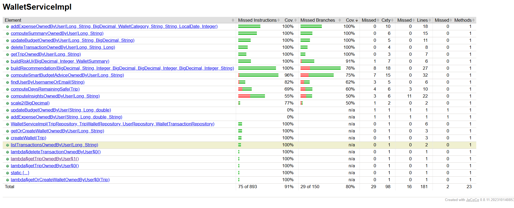

# Proiect TSS — Testarea Sistemelor Software
## Echipa 13 — Modul Wallet (WalletServiceImpl)

---

## Componența echipei

| Nume | Rol |
|------|-----|
| Iftime Raluca | Șef echipă |
| Lupeș Ioan-Marian | Membru |
| Denisa Gheorghe | Membru |

---

## Cuprins

1. [Descriere proiect](#descriere-proiect)
2. [Configurare software](#configurare-software)
3. [Structura proiectului](#structura-proiectului)
4. [Clasa testată](#clasa-testata)
5. [Strategii de testare aplicate](#strategii-de-testare-aplicate)
6. [Rezultate JaCoCo](#rezultate-jacoco)
7. [Rezultate PITest](#rezultate-pitest)
8. [Suita AI — comparație](#suita-ai--comparatie)
9. [Cum rulezi proiectul](#cum-rulezi-proiectul)
10. [Referințe](#referinte)

---

## Descriere proiect

Proiectul implementează o aplicație web de gestiune a călătoriilor, dezvoltată cu Spring Boot. Modulul testat este **WalletServiceImpl** — un serviciu de gestiune a bugetului per călătorie, care oferă funcționalități precum:

- Creare și gestionare portofel per itinerariu
- Setare și actualizare buget total (RON / EUR)
- Adăugare și ștergere tranzacții (cheltuieli pe categorii)
- Calculul unui sumar KPI: buget total, cheltuit, rămas, procent utilizat, status
- Generare insights pe categorii de cheltuieli și zile active
- Recomandări inteligente de buget (burn-rate, allowance/zi, forecast depășire)

---

## Configurare software

| Tool | Versiune |
|------|----------|
| Java | OpenJDK 24 |
| Spring Boot | 3.3.4 |
| Maven | 3.8+ |
| JUnit | 5.10.3 |
| Mockito | 5.11.0 |
| JaCoCo | 0.8.11 |
| PITest | 1.16.3 |
| IntelliJ IDEA | 2024.3.5 |

---

## Structura proiectului

```
src/
├── main/java/echipa13/calatorii/
│   ├── service/impl/
│   │   └── WalletServiceImpl.java         ← clasa testată
│   ├── models/
│   │   ├── Trip.java
│   │   ├── TripWallet.java
│   │   ├── WalletTransaction.java
│   │   ├── WalletCategory.java
│   │   └── UserEntity.java
│   ├── repository/
│   │   ├── TripRepository.java
│   │   ├── TripWalletRepository.java
│   │   ├── UserRepository.java
│   │   └── WalletTransactionRepository.java
│   └── Dto/
│       ├── WalletSummary.java
│       ├── WalletInsights.java
│       └── WalletCategoryTotal.java
│
└── test/java/echipa13/calatorii/service/impl/
    ├── WalletServiceImplEquivalenceTest.java    ← EP
    ├── WalletServiceImplBoundaryTest.java       ← BVA
    ├── WalletServiceImplStatementTest.java      ← Statement
    ├── WalletServiceImplDecisionTest.java       ← Decision
    ├── WalletServiceImplConditionTest.java      ← Condition
    ├── WalletServiceImplCircuitsTest.java       ← Basis Path
    ├── WalletServiceImplMutationTest.java       ← Mutation
    ├── WalletServiceImplMathTest.java           ← Math mutanți
    └── WalletServiceImplAITest.java             ← Suita AI (comparație)

docs/
├── ai-report.md                                ← raport comparativ AI
└── screenshots/
    ├── jacoco-report.png
    ├── pitest-report.png
    ├── ai-prompt.png
    └── ai-build-failed.png
```

---

## Clasa testată

**`WalletServiceImpl`** — 435 linii, complexitate McCabe V(G) ≈ 8-10.

Metodele testate în ordinea priorității:

| Metodă | Complexitate | Strategii aplicate |
|--------|-------------|-------------------|
| `computeSummaryOwnedByUser` | ridicată | EP, BVA, Decision, Condition, Circuits, Mutation |
| `addExpenseOwnedByUser` | ridicată | EP, BVA, Statement |
| `updateBudgetOwnedByUser` | medie | BVA |
| `computeInsightsOwnedByUser` | medie | Statement |
| `getOrCreateWalletOwnedByUser` | scăzută | Statement, Mutation |

De ce am ales această clasă:
- Are logică matematică reală cu `BigDecimal` și rounding `HALF_UP`
- Are 15+ condiții `if/else` — teren fertil pentru branch coverage
- Are o stare machine clară: `OK / ATENTIE / DEPASIT / NESETAT`
- Metodele sunt pure și ușor de testat cu Mockito fără bază de date

---

## Strategii de testare aplicate

### 1. Partiționare în clase de echivalență — `WalletServiceImplEquivalenceTest`

Împărțirea inputurilor în clase unde comportamentul serviciului este identic.

**Clase de echivalență pentru `computeSummaryOwnedByUser`:**

| Clasă | Condiție | Status așteptat |
|-------|----------|-----------------|
| CE1 | budget = null | NESETAT |
| CE2 | budget = 0 | NESETAT |
| CE3 | 0% ≤ cheltuit < 75% | OK |
| CE4 | 75% ≤ cheltuit < 100% | ATENTIE |
| CE5 | cheltuit ≥ 100% | DEPASIT |
| CE6 | totalSpent = null din DB | OK (tratat ca zero) |

**Clase de echivalență pentru `addExpenseOwnedByUser`:**

| Clasă | Condiție | Comportament |
|-------|----------|-------------|
| CE7 | amount ≤ 0 | IllegalArgumentException |
| CE8 | amount > 0 | salvat corect |
| CE9 | title blank | IllegalArgumentException |
| CE10 | title non-blank | salvat corect |
| CE11 | dayIndex ≤ 0 | IllegalArgumentException |
| CE12 | dayIndex ≥ 1 | salvat corect |

---

### 2. Analiza valorilor de frontieră — `WalletServiceImplBoundaryTest`

Testarea valorilor exacte de pe frontierele condițiilor din cod.

**Frontiere pentru procent buget:**

```
0%----74%  |  75%----99%  |  100%+
   OK      |   ATENTIE    |  DEPASIT
           ↑              ↑
        testăm         testăm
        74 și 75       99 și 100
```

| Valoare testată | Procent | Status așteptat | Justificare |
|-----------------|---------|-----------------|-------------|
| 74 RON / 100 RON | 74% | OK | ultimul OK, chiar sub prag |
| 75 RON / 100 RON | 75% | ATENTIE | exact pe prag, primul ATENTIE |
| 99 RON / 100 RON | 99% | ATENTIE | ultimul ATENTIE |
| 100 RON / 100 RON | 100% | DEPASIT | exact pe prag, primul DEPASIT |

**Frontiere pentru `addExpenseOwnedByUser`:**

| Parametru | Valoare testată | Valid/Invalid | Justificare |
|-----------|----------------|---------------|-------------|
| amount | 0 | ❌ Invalid | exact pe frontieră `<= 0` |
| amount | 0.01 | ✅ Valid | primul valid |
| amount | -10 | ❌ Invalid | sub frontieră |
| title | "" | ❌ Invalid | string gol |
| title | "a" | ✅ Valid | cel mai scurt valid |
| dayIndex | 0 | ❌ Invalid | exact pe frontieră `<= 0` |
| dayIndex | 1 | ✅ Valid | primul valid |
| dayIndex | 999 | ✅ Valid | valoare mare, acceptată |

---

### 3. Acoperire la nivel de instrucțiune — `WalletServiceImplStatementTest`

Fiecare linie de cod executată cel puțin o dată de teste.

**Rezultate JaCoCo — Statement Coverage:** 91% (818 din 893 instrucțiuni)

Liniile neacoperite sunt în metodele cu complexitate ridicată:
- `computeSmartBudgetAdviceOwnedByUser` — 96% instrucțiuni acoperite
- `computeInsightsOwnedByUser` — 55% instrucțiuni acoperite
- `findUserByUsernameOrEmail` — 82% instrucțiuni acoperite

---

### 4. Acoperire la nivel de decizie — `WalletServiceImplDecisionTest`

Fiecare instrucțiune `if` evaluată atât pe `true` cât și pe `false`.

**Rezultate JaCoCo — Branch Coverage:** 80% (121 din 150 ramuri)

Decizii acoperite complet (100%):
- `addExpenseOwnedByUser` — toate ramurile
- `computeSummaryOwnedByUser` — toate ramurile
- `updateBudgetOwnedByUser` — toate ramurile
- `deleteTransactionOwnedByUser` — toate ramurile

Decizii parțial acoperite:
- `buildRecommendation` — 76% ramuri
- `computeSmartBudgetAdviceOwnedByUser` — 75% ramuri
- `computeInsightsOwnedByUser` — 50% ramuri

---

### 5. Acoperire la nivel de condiție — `WalletServiceImplConditionTest`

Fiecare condiție dintr-o expresie compusă evaluată independent pe `true` și `false`.

Exemplu pentru condiția compusă din `computeSummaryOwnedByUser`:
```java
if (budget == null || budget.compareTo(BigDecimal.ZERO) <= 0)
```

| Test | budget | Rezultat condiție | Status |
|------|--------|-------------------|--------|
| budget null | null | true (primul termen) | NESETAT |
| budget zero | 0 | true (al doilea termen) | NESETAT |
| budget valid | 200 | false (ambii termeni) | continuă calculul |

---

### 6. Circuite independente — `WalletServiceImplCircuitsTest`

Complexitatea McCabe V(G) = număr decizii + 1.

Pentru `computeSummaryOwnedByUser`: V(G) = 4 decizii + 1 = **5 circuite minime**.

Am identificat și testat **7 circuite independente**:

| Circuit | Descriere | Test |
|---------|-----------|------|
| C1 | User negăsit → excepție | `circuit_user_not_found` |
| C2 | Wallet negăsit → excepție | `circuit_wallet_not_found` |
| C3 | 0-74% → OK | `circuit_OK_state` |
| C4 | 75-99% → ATENTIE | `circuit_WARNING_state` |
| C5 | ≥100% → DEPASIT | `circuit_OVER_state` |
| C6 | Exact 75% → ATENTIE | `circuit_boundary_75` |
| C7 | null din DB → 0% → OK | `circuit_null_sum_should_be_zero` |

---

### 7. Analiză raport mutanți + teste suplimentare — `WalletServiceImplMathTest` + `WalletServiceImplMutationTest`

**Mutation Score final: 60%** (125 din 211 mutanți omorâți)

Raport detaliat pe tipuri de mutatori:

| Mutator | Generat | Omorât | Supraviețuit | Kill Rate |
|---------|---------|--------|--------------|-----------|
| NullReturnValsMutator | 18 | 17 | 1 | 94% |
| VoidMethodCallMutator | 11 | 11 | 0 | **100%** |
| RemoveConditionalMutator_EQUAL | 53 | 30 | 22 | 57% |
| RemoveConditionalMutator_ORDER | 21 | 12 | 8 | 57% |
| ConditionalsBoundaryMutator | 21 | 7 | 13 | 33% |
| EmptyObjectReturnValsMutator | 9 | 4 | 2 | 44% |
| MathMutator | 4 | 0 | 2 | **0%** |
| **TOTAL** | **211** | **125** | ~76 | **60%** |

**Cei 2 mutanți neechivalenți omorâți explicit:**

**Mutantul 1 — MathMutator** (`*` înlocuit cu `/`):
PITest a schimbat calculul procentului din:
```java
totalSpent.multiply(BigDecimal.valueOf(100)).divide(budget, 0, RoundingMode.HALF_UP)
```
în varianta cu operatori inversați. Testul `should_kill_percent_math_mutations` îl omoară verificând că `50 / 200 * 100 = 25%` exact, nu altă valoare.

**Mutantul 2 — ConditionalsBoundaryMutator** (`>=` înlocuit cu `>`):
PITest a schimbat `if (percent >= 75)` în `if (percent > 75)`. Diferența: cu `>=` valoarea 75 intră în ATENTIE, cu `>` rămâne în OK. Testul `testSumar_ExactPragAtentie_75LaSuta` îl omoară verificând că exact 75% produce ATENTIE.

---

## Rezultate JaCoCo



**Statement Coverage: 91%** (818/893 instrucțiuni)
**Branch Coverage: 80%** (121/150 ramuri)

| Metodă | Statement Cov. | Branch Cov. |
|--------|---------------|-------------|
| `addExpenseOwnedByUser` | 100% | 100% |
| `computeSummaryOwnedByUser` | 100% | 100% |
| `updateBudgetOwnedByUser` | 100% | 100% |
| `deleteTransactionOwnedByUser` | 100% | 100% |
| `buildRiskUi` | 100% | 91% |
| `buildRecommendation` | 100% | 76% |
| `computeSmartBudgetAdviceOwnedByUser` | 96% | 75% |
| `findUserByUsernameOrEmail` | 82% | 62% |
| `computeInsightsOwnedByUser` | 55% | 50% |

---

## Rezultate PITest

**Mutation Score: 60%** — 125 din 211 mutanți omorâți

**Puncte forte:**
- `VoidMethodCallMutator` — 100%: toate apelurile la repository verificate cu `verify()`
- `NullReturnValsMutator` — 94%: toate obiectele returnate verificate cu `assertNotNull`

**Puncte slabe:**
- `MathMutator` — 0%: liniile de calcul matematic din metodele complexe neacoperite complet
- `ConditionalsBoundaryMutator` — 33%: lipsesc teste pe toate valorile exacte de frontieră

---

## Suita AI — comparație

Raport complet în [docs/ai-report.md](docs/ai-report.md).

**Rezultat rapid:**

| Criteriu | Suita proprie | Suita AI |
|----------|---------------|----------|
| Nr. teste | ~40 | ~10 |
| Compilează | ✅ Da | ❌ Build Failed (40+ erori) |
| Rulează | ✅ Da | ❌ Nu compilează |
| Statement coverage | 91% | 0% |
| Branch coverage | 80% | 0% |
| Mutation score | 60% | 0% |

---

## Cum rulezi proiectul

### Cerințe
- Java 17+
- Maven 3.8+

### Rulare teste unitare
```bash
mvn test
```

### Rulare JaCoCo
```bash
mvn test
# deschide target/site/jacoco/index.html
```

### Rulare PITest
```bash
mvn test-compile org.pitest:pitest-maven:mutationCoverage
# deschide target/pit-reports/index.html
```

### Rulare doar suita proprie (fără AI)
```bash
mvn test -Dtest="WalletServiceImplEquivalenceTest,WalletServiceImplBoundaryTest,WalletServiceImplStatementTest,WalletServiceImplDecisionTest,WalletServiceImplConditionTest,WalletServiceImplCircuitsTest,WalletServiceImplMutationTest,WalletServiceImplMathTest"
```

---

## Referințe

[1] Myers, G. J., Sandler, C., Badgett, T., The Art of Software Testing, 3rd Edition, Wiley, 2011.

[2] Martin, R. C., Clean Code: A Handbook of Agile Software Craftsmanship, Prentice Hall, 2008.

[3] PITest Documentation, https://pitest.org/quickstart/maven/, Data ultimei accesări: aprilie 2026.

[4] JaCoCo Documentation, https://www.jacoco.org/jacoco/trunk/doc/, Data ultimei accesări: aprilie 2026.

[5] Mockito Documentation, https://javadoc.io/doc/org.mockito/mockito-core/latest/, Data ultimei accesări: aprilie 2026.

[6] JUnit 5 Documentation, https://junit.org/junit5/docs/current/user-guide/, Data ultimei accesări: aprilie 2026.

[7] OpenAI, ChatGPT, https://chat.openai.com, Data generării: aprilie 2026. Folosit pentru generarea suitei AI (WalletServiceImplAITest.java).

[8] Anthropic, Claude (claude-sonnet-4-6), https://claude.ai, Data generării: aprilie 2026. Folosit ca asistent pentru debug Mockito, explicații mutanți PITest și structurarea strategiei de testare pentru suita proprie.
