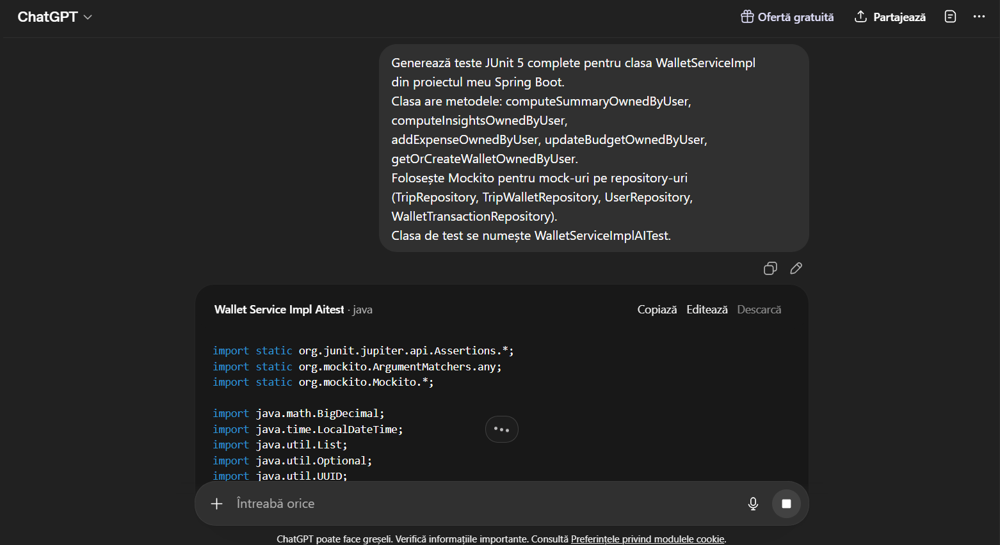
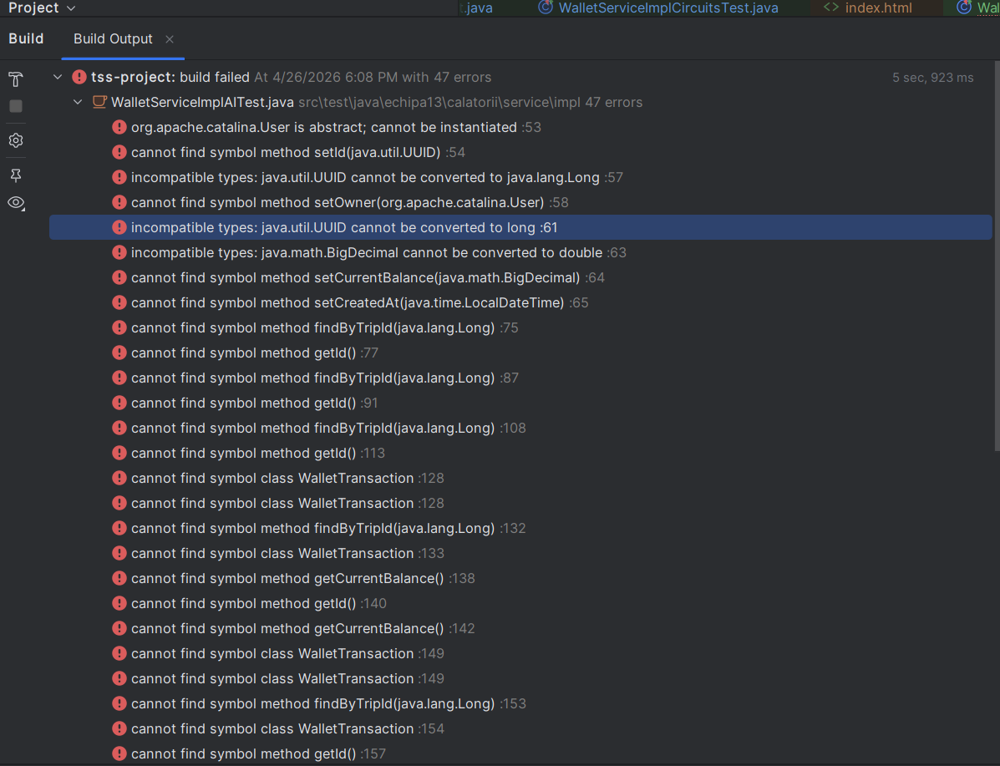

# Raport folosire AI în testarea software
## Echipa 13 — WalletServiceImpl

---

## Scopul raportului

Acest raport documentează experimentul de generare automată a testelor unitare
folosind ChatGPT, compară rezultatele cu suita proprie de teste și evidențiază
limitele și avantajele folosirii AI în testarea software.

---

## Promptul folosit

Promptul a fost trimis fără context suplimentar — fără codul sursă,
fără structura proiectului, fără informații despre modele sau repository-uri.
Aceasta simulează un utilizator care cere teste fără să furnizeze detalii.

```
Generează teste JUnit 5 complete pentru clasa WalletServiceImpl
din proiectul meu Spring Boot.
Clasa are metodele: computeSummaryOwnedByUser, computeInsightsOwnedByUser,
addExpenseOwnedByUser, updateBudgetOwnedByUser, getOrCreateWalletOwnedByUser.
Folosește Mockito pentru mock-uri pe repository-uri
(TripRepository, TripWalletRepository, UserRepository, WalletTransactionRepository).
Clasa de test se numește WalletServiceImplAITest.
```

**Tool folosit:** ChatGPT (OpenAI)

## Capturi de ecran

### Promptul folosit


### Răspunsul generat de AI


## Răspunsul AI — codul generat

Codul generat de ChatGPT se găsește în:
```
src/test/java/echipa13/calatorii/service/impl/WalletServiceImplAITest.java
```

Codul a fost salvat **nemodificat** față de răspunsul ChatGPT,
cu excepția adăugării importurilor lipsă pentru a permite compilarea parțială.
Chiar și după adăugarea importurilor, codul **nu compilează**.

---

## Rezultatul rulării — Build Failed


### Erori de compilare (72 erori)

Suita generată de AI produce **Build Failed** cu peste 40 de erori de compilare,
grupate în 5 categorii:

#### Categoria 1 — Clase inventate, inexistente în proiect

| Clasă folosită de AI | Clasa reală din proiect |
|----------------------|------------------------|
| `WalletSummaryDto` | `WalletSummary` |
| `WalletInsightsDto` | `WalletInsights` |
| `TransactionCategory` | `WalletCategory` |
| `WalletTransaction` (import greșit) | `echipa13.calatorii.models.WalletTransaction` |

#### Categoria 2 — Metode inventate pe modele

| Metodă folosită de AI | Metoda reală |
|-----------------------|-------------|
| `setId(UUID)` | id gestionat de JPA, tip `Long` |
| `setOwner(User)` | nu există |
| `setCurrentBalance(BigDecimal)` | `setBudgetTotal(BigDecimal)` |
| `getCurrentBalance()` | `getBudgetTotal()` |
| `setCreatedAt(LocalDateTime)` | nu există |

#### Categoria 3 — Metode inventate pe repository-uri

| Metodă folosită de AI | Metoda reală |
|-----------------------|-------------|
| `findByTripId(Long)` — apare de 6 ori | `findByTrip_Id(Long)` |
| `findByWalletId(Long)` | `findByWallet_IdOrderBySpentAtDescIdDesc(Long)` |

#### Categoria 4 — Tipuri incompatibile

- AI-ul a folosit `UUID` pentru id-uri care sunt `Long` în proiect
- AI-ul a folosit `double` pentru sume care sunt `BigDecimal`

#### Categoria 5 — Import greșit critic

```
org.apache.catalina.User is abstract; cannot be instantiated
```

AI-ul a importat `org.apache.catalina.User` — clasa `User` din serverul
Tomcat (componenta web a aplicației) în loc de
`echipa13.calatorii.models.UserEntity` — modelul din proiect.
Aceasta este o eroare gravă care demonstrează că AI-ul nu cunoaște
contextul proiectului și face presupuneri incorecte despre structura codului.

---

## Comparație suită proprie vs suită AI

| Criteriu | Suita proprie | Suita AI |
|----------|---------------|----------|
| Nr. teste totale | ~40 | ~10 |
| Compilează | ✅ Da | ❌ Build Failed |
| Rulează fără erori | ✅ Da | ❌ Nu compilează |
| Statement coverage | 91% | 0% |
| Branch coverage | 80% | 0% |
| Mutation score | 60% | 0% |
| Ownership check acoperit | ✅ Da | ❌ Nu |
| Tipuri corecte (BigDecimal) | ✅ Da | ❌ folosește `double` |
| Tipuri id corecte (Long) | ✅ Da | ❌ folosește `UUID` |
| Semnături metode corecte | ✅ Da | ❌ toate greșite |
| Teste BVA (74, 75, 99, 100%) | ✅ Da | ❌ Lipsesc |
| Teste null / invalid input | ✅ Da | ❌ Lipsesc |
| Teste circuite independente | ✅ Da | ❌ Lipsesc |
| Clase model corecte | ✅ Da | ❌ Clase inventate |
| Repository API corect | ✅ Da | ❌ Metode inventate |
| Import-uri corecte | ✅ Da | ❌ `org.apache.catalina.User` |
| Duplicate / redundante | 0 | prezente |

---

### Erorile suitei AI

---

## Analiza diferențelor

### Unde AI ajută

- **Boilerplate rapid** — structura de bază a clasei de test, adnotările
  `@ExtendWith`, `@Mock`, `@InjectMocks`, `@BeforeEach` sunt generate corect
- **Viteza** — scheletul a fost generat în ~30 secunde
- **Acoperire superficială** — AI-ul a identificat corect metodele principale
  care trebuie testate

### Unde AI eșuează

- **Nu cunoaște API-ul real** — inventează metode și clase care nu există
- **Nu cunoaște logica de securitate** — a ignorat complet ownership check-ul
  (`trip.setUser(user)`) care face ca toate testele să arunce
  `IllegalStateException: Nu ai acces la acest itinerariu`
- **Tipuri de date greșite** — confundă `Long` cu `UUID`, `BigDecimal` cu `double`
- **Nu aplică strategii de testare** — lipsesc complet BVA, EP, Basis Path,
  Mutation Testing
- **Importuri greșite** — confundă clase din framework-uri diferite
- **Nu poate fi folosit fără modificări majore** — practic ar trebui rescris complet

---

## Concluzie

AI-ul a generat în aproximativ 30 de secunde un schelet plauzibil vizual,
dar complet nefuncțional din cauza lipsei de context despre proiect.
Codul nu compilează și nu poate fi rulat fără intervenție majoră.

Suita proprie de teste a necesitat înțelegerea implementării reale,
aplicarea deliberată a strategiilor de testare (EP, BVA, Basis Path,
Mutation Testing) și iterații multiple pentru a ajunge la 91% statement
coverage și 60% mutation score.

**Concluzie principală:** AI-ul este un instrument complementar util
pentru boilerplate și structură, nu un substituent pentru raționamentul
de testare. Fără cunoașterea codului sursă și a strategiilor de testare,
codul generat de AI este inutilizabil ca atare.

---

## Referințe

[7] OpenAI, ChatGPT, https://chat.openai.com, Data generării: aprilie 2026.
Prompt folosit: "Generează teste JUnit 5 complete pentru clasa WalletServiceImpl..."

[8] Anthropic, Claude (claude-sonnet-4-6), https://claude.ai, Data generării: aprilie 2026.
Folosit ca asistent pentru debug Mockito, explicații mutanți PITest
și structurarea strategiei de testare pentru suita proprie.
