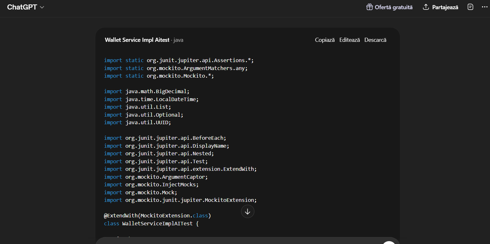
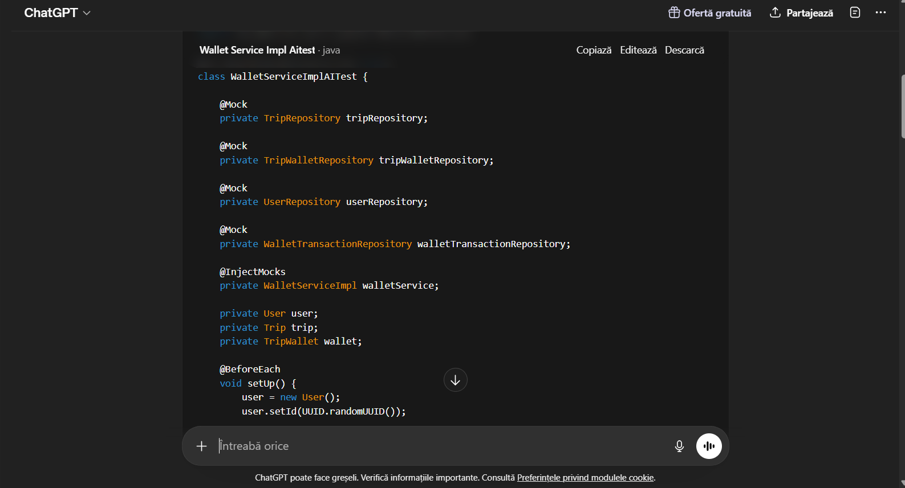
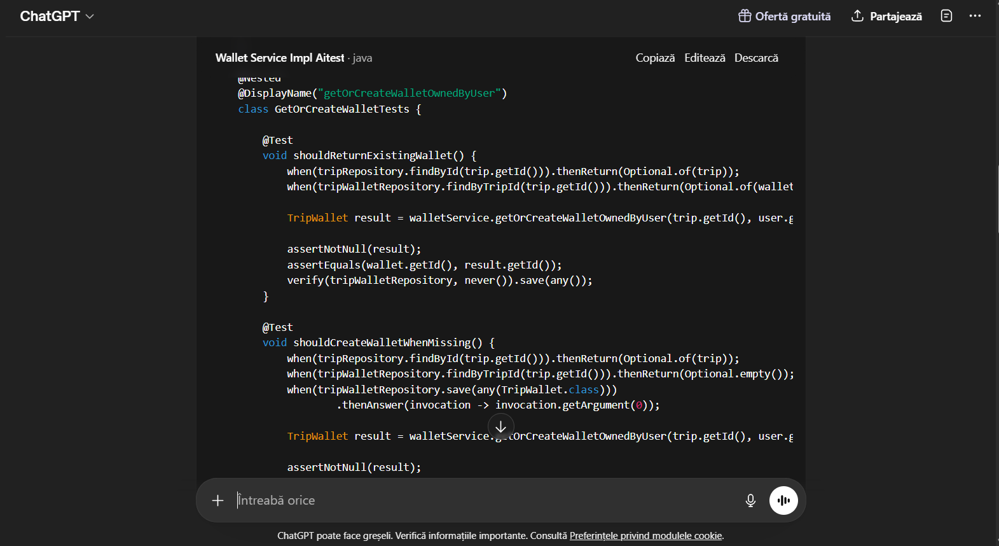

# Raport folosire AI în testarea software
## Clasa WalletServiceImpl

## Scopul raportului

Raportul de față documentează un experiment în care am cerut unui tool AI (ChatGPT) să genereze automat o suită de teste unitare pentru clasa `WalletServiceImpl`, fără să-i furnizăm contextul codului. După aceea am comparat suita generată cu cea scrisă de noi și am analizat ce iese bine, ce iese rău și de ce.

Ideea experimentului a fost simplă: simulăm un dezvoltator care folosește AI-ul „naiv”, fără să copieze codul sursă în prompt. E un scenariu realist pentru proiecte mai mari, unde nu poți pur și simplu să dai în AI tot codul.

## Promptul folosit

Promptul a fost trimis fără context suplimentar - fără cod sursă, fără structura proiectului, fără modelele JPA sau repository-urile reale.

```
Generează teste JUnit 5 complete pentru clasa WalletServiceImpl
din proiectul meu Spring Boot.
Clasa are metodele: computeSummaryOwnedByUser, computeInsightsOwnedByUser,
addExpenseOwnedByUser, updateBudgetOwnedByUser, getOrCreateWalletOwnedByUser.
Folosește Mockito pentru mock-uri pe repository-uri
(TripRepository, TripWalletRepository, UserRepository, WalletTransactionRepository).
Clasa de test se numește WalletServiceImplAITest.
```

Tool folosit: ChatGPT (OpenAI).

## Capturi de ecran

### Promptul


### Răspunsul generat







## Răspunsul AI - codul generat

Codul generat de ChatGPT se găsește în:

```
src/test/java/echipa13/calatorii/service/impl/WalletServiceImplAITest.java
```

L-am salvat aproape neschimbat față de răspunsul original. Singura modificare a fost adăugarea de import-uri lipsă, ca să încercăm măcar să-l compilăm. Și chiar cu import-urile adăugate, codul tot nu compilează - ceea ce e exact punctul interesant al experimentului.

## Rezultatul rulării — Build Failed

### Erori de compilare (47 erori)

Suita generată a produs Build Failed cu peste 40 de erori, pe care le-am grupat în 5 categorii:

#### 1. Clase inventate, inexistente în proiect

| Clasă folosită de AI | Clasa reală |
|----------------------|------------------------|
| `WalletSummaryDto` | `WalletSummary` |
| `WalletInsightsDto` | `WalletInsights` |
| `TransactionCategory` | `WalletCategory` |
| `WalletTransaction` (import greșit) | `echipa13.calatorii.models.WalletTransaction` |

#### 2. Metode inventate pe modele

| Metodă folosită de AI | Metoda reală |
|-----------------------|-------------|
| `setId(UUID)` | id-ul e gestionat de JPA, e `Long`, nu `UUID` |
| `setOwner(User)` | nu există |
| `setCurrentBalance(BigDecimal)` | `setBudgetTotal(BigDecimal)` |
| `getCurrentBalance()` | `getBudgetTotal()` |
| `setCreatedAt(LocalDateTime)` | nu există ca setter public |

#### 3. Metode inventate pe repository-uri

| Metodă folosită de AI | Metoda reală |
|-----------------------|-------------|
| `findByTripId(Long)` (apare de 6 ori) | `findByTrip_Id(Long)` |
| `findByWalletId(Long)` | `findByWallet_IdOrderBySpentAtDescIdDesc(Long)` |

Diferența pare minoră (un underscore), dar în Spring Data JPA contează: convenția cu `_` indică explicit că ne referim la un câmp imbricat (proprietatea `id` a entității asociate `trip`). AI-ul a presupus convenția simplă fără underscore, care nu există în proiectul nostru.

#### 4. Tipuri incompatibile

- AI-ul a folosit `UUID` pentru id-uri care în proiect sunt `Long`.
- A folosit `double` pentru sume care în proiect sunt `BigDecimal`.

A doua chestie e mai gravă pentru că `BigDecimal` e folosit explicit pentru a evita erorile de rotunjire la calcule monetare. Înlocuirea cu `double` ar însemna o schimbare semantică reală.

#### 5. Import greșit critic

```
org.apache.catalina.User is abstract; cannot be instantiated
```

AI-ul a importat `org.apache.catalina.User` - clasa `User` din serverul Tomcat - în locul `echipa13.calatorii.models.UserEntity` din proiect. E genul de eroare care apare când IDE-ul îți sugerează „User” și autocompletul ia primul rezultat din classpath, dar AI-ul nu are acces la classpath-ul proiectului, deci a tras la sorți. A nimerit o clasă abstractă, ceea ce face și mai amuzantă situația - codul nici măcar nu se poate instanția.

### Erorile suitei AI


## Comparație suită proprie vs suită AI

| Criteriu | Suita proprie | Suita AI |
|----------|---------------|----------|
| Nr. teste totale | ~40 | ~10 |
| Compilează | Da | Nu |
| Rulează fără erori | Da | Nu compilează |
| Statement coverage | 91% | 0% |
| Branch coverage | 80% | 0% |
| Mutation score | 60% | 0% |
| Ownership check acoperit | Da | Nu |
| Tipuri corecte (BigDecimal) | Da | folosește `double` |
| Tipuri id corecte (Long) | Da | folosește `UUID` |
| Semnături metode corecte | Da | toate greșite |
| Teste BVA (74, 75, 99, 100%) | Da | Lipsesc |
| Teste null / invalid input | Da | Lipsesc |
| Teste circuite independente | Da | Lipsesc |
| Clase model corecte | Da | Inventate |
| API repository corect | Da | Inventat |
| Import-uri corecte | Da | `org.apache.catalina.User` |
| Duplicate / redundante | 0 | prezente |

## Analiza diferențelor

### Unde AI-ul ajută

- **Boilerplate rapid.** Structura de bază a clasei de test - adnotările `@ExtendWith(MockitoExtension.class)`, `@Mock`, `@InjectMocks`, metoda `@BeforeEach` - este generată corect și convențional. Dacă pornești de la zero, primești scheletul în 30 de secunde.
- **Identifică metodele care merită testate.** AI-ul a recunoscut corect care sunt metodele publice principale și a încercat să facă teste pentru fiecare.
- **Convențiile generale de naming.** Numele testelor (gen `shouldReturnSummaryWhenBudgetIsSet`) sunt rezonabile și aliniate cu stilul JUnit modern.

### Unde AI-ul greșește

- **Inventează API.** Cea mai gravă problemă: AI-ul nu cunoaște codul real, dar trebuie să producă ceva, deci „presupune” cum ar trebui să arate metodele. Ghicește pe baza unor proiecte similare pe care le-a văzut în training. Rezultatul e un cod care arată plauzibil din afară, dar nu compilează în proiectul nostru.
- **Ratează logica de securitate.** Toate metodele din `WalletServiceImpl` au un ownership check (`trip.getUser().getId() == currentUser.getId()`), care aruncă `IllegalStateException` dacă userul curent încearcă să acceseze itinerariul altcuiva. AI-ul a ignorat complet acest aspect. Practic, dacă rulam codul lui pe modelul nostru real (cu ownership check), absolut toate testele ar fi aruncat „Nu ai acces la acest itinerariu”.
- **Confundă tipurile de date.** `Long` cu `UUID`, `BigDecimal` cu `double`. Sunt erori care la o privire rapidă par „aproape corecte”, dar care în practică schimbă semantica.
- **Nu aplică deloc strategii de testare structurate.** Nu există BVA, EP, Basis Path, Mutation Testing - zero. Doar câteva teste happy-path, plus unul-două cu input invalid.
- **Import-uri greșite.** Aici e clar că AI-ul „ghicește” pe baza numelui scurt al clasei.

### O observație colaterală

Un detaliu interesant: codul generat e suficient de bine structurat încât arată ca un test bun la o privire rapidă. Dacă l-ai scana fără să-l rulezi, ai putea să crezi că e perfect funcțional. Asta e probabil cea mai mare capcană a folosirii AI-ului în testare - nu e că nu produce nimic, ci că produce ceva care pare bun fără să fie.

Rezultatul concret: dacă cineva ar fi pus codul în repository și ar fi spus „done”, build-ul s-ar fi rupt la primul `mvn compile`, iar timpul „economisit” cu AI-ul s-ar fi pierdut imediat la debug.

## Concluzie

AI-ul a generat în 30 de secunde un schelet plauzibil dar nefuncțional. Codul nu compilează și nu poate fi rulat fără rescriere semnificativă. În contrast, suita proprie - care a luat câteva zile de muncă efectivă - a necesitat înțelegerea reală a implementării, alegerea deliberată a strategiilor (EP, BVA, Statement, Decision, Condition, Basis Path, Mutation) și iterare progresivă până la 91% statement coverage și 60% mutation score.

Concluzia principală pe care am tras-o: AI-ul e un instrument complementar, util pentru boilerplate și pentru a-ți da un punct de pornire, dar nu poate înlocui raționamentul de testare. Fără cunoașterea concretă a codului sursă și fără aplicarea conștientă a strategiilor structurate, codul generat e impresionant la suprafață și inutilizabil în practică.

Pentru viitor, scenariul realist de folosire ar fi: AI-ul îți dă scheletul + o primă rundă de teste happy-path, iar tu, ca dezvoltator, completezi BVA, edge cases, ownership checks și mutation kills. Adică AI-ul îți face partea „plicticoasă”, iar tu rezolvi partea „grea”.

## Referințe

[7] OpenAI, ChatGPT, https://chat.openai.com, generare aprilie 2026.
Prompt folosit: „Generează teste JUnit 5 complete pentru clasa WalletServiceImpl...”

[8] Anthropic, Claude, https://claude.ai, aprilie 2026. Folosit ca asistent pentru debug Mockito, explicații pe mutanți PITest și pentru structurarea strategiei de testare a suitei proprii.
